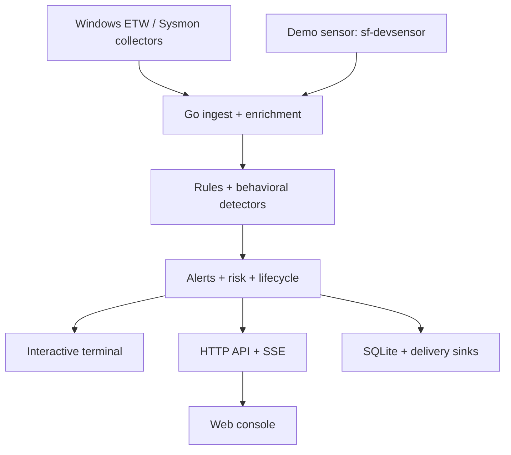

# security-framework

**Windows endpoint telemetry, behavioral detection, an interactive CLI and a live SOC console.**

[](https://github.com/Ruby570bocadito/security-framework/actions/workflows/ci.yml)
[](LICENSE)
[](go.mod)
[](CHANGELOG.md)

[Quickstart](#quickstart) · [Interactive CLI](#interactive-cli) · [Web console](#web-console) · [Documentation](#documentation) · [Roadmap](#roadmap) · **[Guía en español](docs/GUIA-INICIO.md)**

A Go engine turns NDJSON telemetry into MITRE ATT&CK detections, kill-chain alerts and decaying host risk scores. YAML rules stay readable and reload in place. Operators investigate through the terminal, HTTP API or browser console, with optional SQLite history and external alert delivery.

**Pre-1.0, intended for labs and research.** The engine, demo and console run independently of Windows. Real Windows collection uses the Rust ETW process collector or the PowerShell Sysmon collector. The Rust collector currently covers process creation; the Sysmon path supplies the broader event set. The separate `sf-devsensor` replays a clearly labeled demo scenario.

## Quickstart

Requirements: **Go 1.22+** for the engine; **Bun** for the optional browser console. Run these commands from the repository root.

```bash
git clone https://github.com/Ruby570bocadito/security-framework.git
cd security-framework
make build
./bin/engine validate
```

Start the engine in one terminal:

```bash
./bin/engine run -i
```

Replay the demo from a second terminal:

```bash
./bin/devsensor -addr 127.0.0.1:7777
```

The panel shows the engine's events and detections. Press `q` to shut down cleanly. For scripts or redirected output, use `./bin/engine run`; requesting `-i` without a terminal automatically uses plain output.

| Component | Default endpoint |
|-----------|------------------|
| Sensor ingest | `127.0.0.1:7777`, NDJSON over TCP |
| Engine API | `http://127.0.0.1:7778`, REST + SSE |
| Web console | `http://localhost:3000` |
| Optional AI analyst hub | `http://127.0.0.1:3003` |

Real telemetry: [Windows installation](docs/OPERATIONS.md#one-command-install-windows) · [Sysmon setup](docs/OPERATIONS.md#real-telemetry-with-sysmon-recommended) · [Rust sensor build](docs/OPERATIONS.md#building-the-real-sensor-windows) · [Docker](docs/OPERATIONS.md#docker).

## Interactive CLI

`engine run -i` provides a bounded, keyboard-driven workspace with alert and rule views. Search by rule, host, user, summary or ATT&CK tag; filter severity; inspect a selected alert or a rule's conditions. Historical selection stays steady when new alerts arrive, and the catalogue follows rule reloads.

| Key | Action |
|-----|--------|
| `1` / `2` / `Tab` | Alerts / rules |
| `↑` / `↓` or `j` / `k` | Select a row; scroll details |
| `PgUp` / `PgDown`, `Home` / `End` | Page, first or last row |
| `Enter` | Open / close details |
| `/` | Search; `Enter` applies, `Esc` clears |
| `s` | Cycle the severity filter |
| `p` / `Space` | Pause / resume the **view** |
| `Esc` | Return to the list; clear filters in the list |
| `?` / `h` | Help |
| `q` / `Ctrl+C` | Stop the engine |

The terminal retains the last **100 alerts**. Pausing leaves ingest, detection, the API and delivery running. Control characters in telemetry are neutralized for human display; JSON evidence remains unchanged. Webhook credentials are hidden in the banner.

```bash
./bin/engine rules                           # inspect the loaded pack
./bin/engine validate                        # configuration errors and warnings
./bin/engine sigma -dir corpus -out rules/imported.yaml
./bin/engine version
./bin/engine run -h                          # complete runtime flags
```

The classic `engine -addr ... -rules ...` invocation still works. Routed commands reject unexpected positional arguments instead of silently ignoring subsequent flags.

## Web console

With the engine running, start the console in another terminal:

```bash
cd web/console
bun install --frozen-lockfile
bun run dev
```

Open **[localhost:3000](http://localhost:3000)**. Telemetry travels directly through the console's same-origin engine proxy. The AI hub is optional:

```bash
# another terminal, from the repository root
cd web/console-service
bun install --frozen-lockfile
bun run dev
```

| View | Operator workflow |
|------|-------------------|
| Panel | Pending critical triage, pipeline issues, manual refresh, KPIs, rolling activity sample and hot hosts |
| Flujo en vivo | Pause, search, event-type filters and JSONL/CSV export |
| Alertas | Live buffer or paged engine history; severity and lifecycle filters; evidence details; acknowledge / close / reopen |
| Reglas / Cadenas | Loaded conditions, ATT&CK mappings and kill-chain steps |
| Supresiones | Loaded operator allowlist, reasons and expirations |
| Respuesta activa | Read-only response state and forensic audit; class filter and export |
| Analista IA | Optional explanation and investigation assistance through your configured model |

Unavailable metrics show **`—`**, rather than zero. The panel distinguishes a reachable API from a reconnecting live channel. Reconnects merge snapshots with incoming frames without duplicating alerts or inflating counters, and a missing optional response surface clears its old state.

Deep links such as `/?view=alertas&historial=1&estado=open&sev=critical&q=lsass` survive refresh and browser history. Navigation also supports `g` followed by `p/f/a/r/c/s/k/n`; a keyboard skip link goes straight to the main content.

In **Alertas**, switch to **Histórico** to search the engine rather than the browser's retained buffer. SQLite provides persisted history when `-store` is enabled; otherwise the view clearly identifies the 256-alert memory window. Pages contain 25 alerts ordered by reception. Cursor navigation pins the upper sequence, so new arrivals do not shift visited pages. Retention and triage decisions can still change membership. **Actualizar histórico** starts a fresh search. Detection evidence and lifecycle state are server filters; lifecycle notes remain searchable in the live view. A bounded scan can return an empty page with **Seguir buscando**, and an older engine reports the missing capability explicitly.

The activity chart is a **sample of the retained event buffer**, not a complete four-minute history at high event rates. Lifetime totals come from the engine.


[Console configuration and AI setup](web/console/README.md) · [Environment template](web/console/.env.example). The capture above predates the operation-summary strip; screenshot sources are kept in [docs/assets](docs/assets/README.md).

## Detection and integrations

| Capability | Shipped surface |
|------------|-----------------|
| Detection content | 23 YAML rules, four kill chains, beaconing profiles and volumetric thresholds |
| Rule workflow | Hot reload, validation, 17 operators and Sigma import |
| Triage | Alert lifecycle, operator notes and host-scoped suppressions |
| Persistence | Optional pure-Go SQLite, WAL and retention |
| Delivery | Webhooks, Elasticsearch, Splunk HEC, Slack, Telegram and email |
| API | REST, SSE, filtered exports, Prometheus and an OpenAPI contract |
| Response | Opt-in, authenticated and audited `kill_process`; console visibility is read-only |

See [the operations guide](docs/OPERATIONS.md) for configuration, detection tables, authentication, TLS and response requirements. See [false-positive control](docs/false-positive-control.md) for noise tuning.

## Architecture



`pkg/model` defines the event contract. The console renders engine data, and the AI hub assists investigation; it does not generate product telemetry. Detailed data flow and package responsibilities: [ARCHITECTURE.md](docs/ARCHITECTURE.md).

## Development

```bash
make test             # Go tests
make ci               # full CI-equivalent checks; prerequisites in Makefile

cd web/console
bun test
bun run typecheck
bun run build
```

CI covers Go formatting, build, vet, staticcheck and race tests; console and hub tests/types; a production console build; the OpenAPI drift guard; Rust checks on Linux and Windows; and a native Windows response smoke.

### Measured performance

Historical loopback runs recorded ingest→alert p99 around **0.4 ms** with the 23-rule pack. This is a lab measurement, not a deployment guarantee. Run `cmd/bench` or the nightly harness to measure your own environment, including SQLite overhead. [Method and results](docs/OPERATIONS.md#measured-performance).

## Repository layout

```text
cmd/engine/           Go engine and interactive CLI
cmd/devsensor/        labeled demo scenario
cmd/bench/            latency and load harness
internal/            detection, persistence, API and delivery packages
pkg/model/           event wire contract
sensor/              Rust Windows ETW collector
rules/  sequences/   YAML detection content
web/console/         Next.js operator console
web/console-service/ Bun + socket.io AI analyst hub
website/             project landing page
scripts/             Windows tooling and verification harnesses
docs/                operations, architecture and development reports
```

## Documentation

| Document | Use it for |
|----------|------------|
| [Guía de inicio](docs/GUIA-INICIO.md) | First run and troubleshooting in Spanish |
| [Operations](docs/OPERATIONS.md) | Installation, flags, API, storage, integrations and CLI |
| [Architecture](docs/ARCHITECTURE.md) | System design and event contract |
| [OpenAPI](docs/api/openapi.yaml) | API integration |
| [False-positive control](docs/false-positive-control.md) | Suppression and deduplication tuning |
| [Complete improvement report](docs/RESUMEN-MEJORAS-2026-10-01.md) | Both improvement rounds, fixed bugs, documentation and confirmed remote CI |
| [CLI/dashboard review](docs/REVISION-CLI-DASHBOARD.md) | First-round findings and verification |
| [Historical investigations](docs/REVISION-HISTORICO.md) | Pagination, lifecycle filters and second-round verification |
| [Technical architecture PDF](docs/arquitectura-tecnica-v0.11.pdf) | Spanish technical reference |
| [Changelog](CHANGELOG.md) | Release history |
| [Security policy](SECURITY.md) | Private vulnerability reporting |

## Roadmap

- **Implemented:** rule and behavioral detection, triage, storage, integrations, terminal workspace and live console.
- **Next interface work:** a command palette, full browser regression tests, saved hunts and moving lifecycle persistence into SQLite.
- **Sensor work:** extend native ETW providers beyond process creation; broaden Windows runtime coverage.
- **Research:** YARA memory scanning and sandboxed extensions.

The broader [gap analysis](docs/analisis-brechas-y-mejoras.md) records proposals and their original context.

## Contributing

Open an issue or a focused PR with the problem, resulting behavior and verification. Detection changes should include the modeled TTP, lab events and the observed false-positive profile. Report vulnerabilities privately using [SECURITY.md](SECURITY.md).

## License

[Apache License 2.0](LICENSE).
