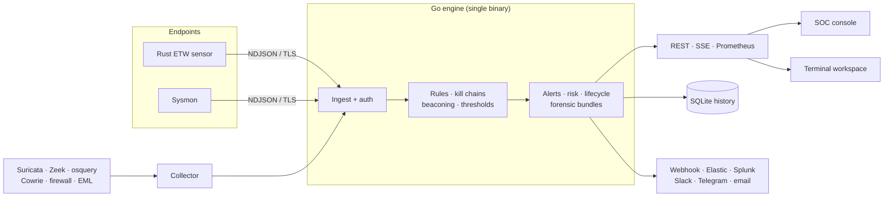

<div align="center">


# bluetardigrade

**SOC detection, investigation and reporting for endpoint, network and mail evidence.**

Named after the most resilient animal on Earth: a static Go engine with
no runtime dependencies, collectors and an operator console.

[](https://github.com/Ruby570bocadito/bluetardigrade/actions/workflows/ci.yml)
[](CHANGELOG.md)
[](LICENSE)
[](go.mod)
[](sensor/)
[](web/console/)

**[Quickstart](#quickstart)** · [Features](#what-you-get) · [Console](#the-soc-console) · [Security model](#security-model) · [Architecture](#architecture) · [Docs](#documentation) · **[Guía en español](docs/GUIA-INICIO.md)**

</div>

bluetardigrade is a self-hosted SOC toolkit for Windows endpoints. A Rust ETW
sensor (or Sysmon) streams process telemetry into a single static Go engine
that detects, correlates and scores it. Analysts then triage, investigate and
respond from a live web console.

<p align="center">
  
</p>

> [!NOTE]
> **Pre-1.0, built for labs, research and small SOC teams.** Product builds
> contain no demo telemetry generator: an empty or disconnected console stays
> empty. Validate the collectors with real host activity before relying on
> them in production.

## Why bluetardigrade

- **One binary, no runtime dependencies.** The engine is a static Go
  executable: ingest, detection, API, SQLite history and delivery in one process.
- **Detections you can read.** Every rule is YAML mapped to MITRE ATT&CK, and
  hot-reloaded. Sigma rules can be imported. Nothing is a black box.
- **From alert to evidence.** Every alert freezes a forensic bundle: the
  triggering event plus a five-minute timeline of the host.
- **Safe by default.** Loopback-only listeners, authenticated ingest,
  append-only evidence, and active response that is off until you arm it.

## What you get

<table>
<tr>
<td width="50%" valign="top">

### Detect
- **114 YAML rules** covering 13 of the 14 ATT&CK tactics: initial access,
  LOLBAS, privilege escalation, credential access, lateral movement,
  collection, exfiltration, ransomware impact, hack tools and phishing.
- **11 kill-chain correlations** across events of the same host (intrusion,
  credential theft, data theft, ransomware preparation, webshells...).
- **C2 beaconing** detection on event time.
- **Volumetric thresholds** and decaying per-host risk scores.
- **Sigma import** and 17 rule operators.

</td>
<td width="50%" valign="top">

### Investigate
- Live SOC console with **eight views**, command palette and deep links.
- **Forensic bundles** (alert + 5 min host timeline) with JSON/JSONL export.
- Paged engine **history** backed by SQLite.
- Alert lifecycle, operator notes and saved searches.
- Markdown/JSON **analyst reports**, plus an optional AI analyst.

</td>
</tr>
<tr>
<td width="50%" valign="top">

### Respond
- Opt-in **`kill_process`** response.
- Requires per-operator credentials, so every action has an owner.
- Every request (executed or denied) lands in a forensic **audit log**.
- Visible in the console's **Respuesta activa** view.

</td>
<td width="50%" valign="top">

### Integrate
- **Webhooks**, **Elasticsearch**, **Splunk HEC**, **Slack**,
  **Telegram** and **email** delivery.
- **REST + SSE** API with an OpenAPI contract checked in CI.
- **Prometheus** metrics.
- Imports **Suricata, Zeek, osquery, Cowrie**, Windows firewall logs and
  offline **EML** mail.

</td>
</tr>
</table>

## Quickstart

> [!IMPORTANT]
> Use **two windows**:
> - a **normal PowerShell** for installing and running the console;
> - a **PowerShell opened as Administrator** for the sensor, because kernel ETW
>   tracing needs elevation.

**1. Install** (normal PowerShell, user-level, no admin):

```powershell
irm https://raw.githubusercontent.com/Ruby570bocadito/bluetardigrade/main/install.ps1 | iex
```

To build the Rust ETW sensor too, or to pass any other option:

```powershell
& ([scriptblock]::Create((irm https://raw.githubusercontent.com/Ruby570bocadito/bluetardigrade/main/install.ps1))) -WithSensor
```

The installer verifies every toolchain download by SHA-256. It then puts
these commands on your `PATH`:

| Command | What it does |
|---|---|
| `sf-engine` | The detection engine |
| `sf-console` | Engine + console |
| `sf-sensor` | Sysmon sensor |
| `sf-collector` | Log and mail importer |
| `sf-update` | Updates the install |
| `sf-uninstall` | Removes it |

**2. Open a new terminal** so the `PATH` change applies, then check the install:

```powershell
sf-engine version
```

**3. Start the engine and the console** (normal PowerShell). The browser opens
at <http://localhost:3000>:

```powershell
sf-console
```

**4. Connect a sensor**, choosing one of these:

- **Rust ETW sensor**, in an Administrator PowerShell:

  ```powershell
  & "$env:LOCALAPPDATA\bluetardigrade\bin\security-sensor.exe" --addr 127.0.0.1:7777 --spool "$env:LOCALAPPDATA\bluetardigrade\spool\sensor.ndjson"
  ```

- **Sysmon**: run `sf-sensor -SetupSysmon` once (UAC prompt), then `sf-sensor`.

**5. Verify the pipeline** end to end:

```powershell
sf-engine doctor
```

**6. Fire a harmless detection.** The download target is a closed local
port, so nothing is fetched:

```powershell
certutil -urlcache -f http://127.0.0.1:9/prueba.txt "$env:TEMP\prueba.txt"
```

The console raises **"Descarga con certutil o bitsadmin"** (MITRE T1105)
within a few seconds.

<details>
<summary><b>Pin a release, run with options, Windows Server</b></summary>

The one-liner and `sf-update` track `main`. For a reproducible install, pin a
release tag in both the URL and `-Branch`:

```powershell
$tag = 'v0.1.0'   # a published tag you reviewed
& ([scriptblock]::Create((irm "https://raw.githubusercontent.com/Ruby570bocadito/bluetardigrade/$tag/install.ps1"))) -Branch $tag
```

Useful installer switches:

| Switch | What it does |
|---|---|
| `-WithSensor` | Also builds the Rust ETW sensor |
| `-AutoStart` | Starts the engine at logon |
| `-IngestToken <t>` | Sets the ingest authentication token |
| `-Server` | Installs boot tasks under ProgramData (admin) |

- **Release provenance:** release binaries carry a Sigstore build attestation
  (`gh attestation verify <file> --repo Ruby570bocadito/bluetardigrade`).
- **Windows Server** without an interactive session:
  [server deployment](docs/WINDOWS-SERVER.md).
- **Smart App Control blocks a binary:** see
  [application-control diagnosis](docs/SMART-APP-CONTROL.md).

</details>

<details>
<summary><b>Linux, macOS or Docker (engine + collectors)</b></summary>

```bash
git clone https://github.com/Ruby570bocadito/bluetardigrade.git
cd bluetardigrade
make build
./bin/engine run -i                       # interactive terminal workspace
./bin/collector -source suricata -observer IDS-01 -file /path/to/eve.json
```

```bash
docker build -t bluetardigrade .
docker run --rm -p 127.0.0.1:7777:7777 -p 127.0.0.1:7778:7778 \
  -e SF_API_TOKEN -e SF_INGEST_TOKEN bluetardigrade
```

| Component | Default endpoint |
|---|---|
| Sensor ingest | `127.0.0.1:7777`: NDJSON over TCP, optional TLS + AUTH |
| Engine API | `http://127.0.0.1:7778`: REST, SSE and Prometheus |
| Web console | `http://localhost:3000` |
| AI analyst hub (optional) | `http://127.0.0.1:3003` |

</details>

## Telemetry sources

| Source | What it collects | Notes |
|---|---|---|
| **Rust ETW sensor** (`sensor/`) | Process creation (full command line, parent, owner SID), TCP connection attempts and writes to the registry keys detections read (Run, IFEO, Defender, LSA, services...) | Bounded queue plus an on-disk spool (`--spool`): an engine restart loses no events |
| **Sysmon** (`sf-sensor`) | Process, network, registry, file and image-load events | Ships a tuned config; `sf-sensor -SetupSysmon` installs it |
| **Collector** (`sf-collector`) | Suricata EVE, Zeek conn, osquery differential, Cowrie, Windows firewall logs, EML mail | Offline import; never runs provider commands or visits mail URLs |

## The SOC console

A Next.js operator console. Everything reaches the engine through its
same-origin proxy, so the API token never reaches the browser.

| View | What the analyst does there |
|---|---|
| **Panel** | Triage backlog, KPIs, activity and severity trends, an investigation graph (hosts, users, processes, detections, destinations), MITRE coverage and a host x tactic heatmap |
| **Flujo en vivo** | Live telemetry with pause, search, type filters and JSONL/CSV export |
| **Alertas** | Live queue or paged history with severity/lifecycle filters. Select several alerts to triage them together, add them to an incident, suppress the rule on that host or export them. The detail adds a per-alert graph, the forensic bundle with its process tree, reputation lookups, containment and reports |
| **Incidentes** | Cases that group alerts: status, severity, owner, summary, affected hosts, an incident graph and a timeline of every change and note |
| **Equipos** | One page per host: risk, live process tree, entity graph, timeline and network destinations |
| **Detección** | Rules with ATT&CK coverage, kill chains drawn as flows with per-step alerts, suppressions, and a rule tester that dry-runs an event against the live rules |
| **Respuesta activa** | Arming state and the forensic response audit |
| **Analista IA** | Optional triage assistant with your own model |

For a wall monitor, **Modo NOC** (header button or command palette)
rotates the situation, the investigation graph and the coverage
full screen. The bell in the header enables browser notifications and
an optional sound for new critical alerts.

Navigation and keyboard support:

- **Command palette:** `Ctrl+K` / `⌘K`.
- **Go to a view:** `g` followed by `p` `f` `a` `i` `e` `r` `c` `s` `t` `k` `n`.
- **Deep links** such as `/?view=alertas&historial=1&sev=critical&q=lsass`
  survive a refresh.
- Full **`prefers-reduced-motion`** support.
- Unavailable metrics show **`—`**, never a fake zero.

<details>
<summary><b>More screenshots</b></summary>

| | |
|---|---|
|  |  |
| Alert triage queue | Live telemetry feed |
|  |  |
| Rules with ATT&CK mapping | Kill-chain correlations |
|  |  |
| Active response audit | Operator suppressions |

</details>

Run the console from source: [web/console/README.md](web/console/README.md).

There is also an **interactive terminal** alternative: `engine run -i`, a
keyboard-driven alert and rule workspace (see the
[operations guide](docs/OPERATIONS.md)).

## Security model

| Layer | Control |
|---|---|
| Ingest | Shared token or **per-sensor identities** bound to their hosts; events for other hosts are refused and counted |
| Transport | Native TLS on both listeners; the sensor trusts only the CA you give it |
| API | Bearer token; listens on loopback by default |
| Console | `CONSOLE_ACCESS_TOKEN` (HTTP Basic) gates every page and API call off-loopback |
| AI hub | `HUB_ACCESS_TOKEN` per socket, Origin allowlist and shared rate limits |
| Response | `kill_process` needs an arm flag, a response token and **per-operator credentials**. Protected processes are refused, and every attempt is audited |
| Evidence | Stored events are **append-only**: a second copy of an event id cannot rewrite the first |
| Supply chain | SHA-pinned GitHub Actions, minimal permissions, Sigstore release attestations |

Report vulnerabilities privately: [SECURITY.md](SECURITY.md).

## Architecture



`pkg/model` defines the event contract that every sensor emits. Package
responsibilities and data flow: [ARCHITECTURE.md](docs/ARCHITECTURE.md).

**Performance**, from loopback lab measurements (not deployment guarantees):

| Measurement | Before | Now |
|---|---|---|
| Throughput with `-store` (SQLite on), using batched transactions | ~8.3k events/s | **~23.6k events/s** |
| Rule field resolution | 8.0 µs per event | **1.7 µs per event** |

Ingest→alert p99 latency was about 0.4 ms. Reproduce the numbers with
`scripts/dev-tests/bench`, following the
[method](docs/OPERATIONS.md#measured-performance).

<details>
<summary><b>Repository layout</b></summary>

```text
cmd/engine/          Go engine, interactive CLI, doctor, reports
cmd/collector/       observed-log and offline mail importer
internal/            detection, correlation, store, API, delivery, response
pkg/model/           event wire contract
sensor/              Rust Windows ETW sensor
rules/  sequences/   YAML detection content and kill chains
web/console/         Next.js SOC console
web/console-service/ Bun + socket.io AI analyst hub
website/             project landing page
scripts/             Windows tooling, dev tests and verification harnesses
docs/                guides, architecture and API reference
```

</details>

## Documentation

| Document | Use it for |
|---|---|
| [Guía de inicio](docs/GUIA-INICIO.md) | First run, operation and troubleshooting (Spanish) |
| [Operations](docs/OPERATIONS.md) | Flags, environment, API, storage, integrations, response, CLI |
| [Architecture](docs/ARCHITECTURE.md) | System design, event contract, feature inventory |
| [Startup fixes](docs/STARTUP-FIXES.md) | Windows startup: hub origin, console CSP, inherited credentials |
| [Deployment doctor](docs/DOCTOR.md) | Diagnosing rules, tokens, TLS, SQLite, sensors and console |
| [False-positive control](docs/false-positive-control.md) | Dedup, suppressions and noise tuning |
| [File detections and evidence](docs/DETECCION-Y-EVIDENCIA.md) | Artifact alarms and forensic evidence |
| [SOC integrations and reports](docs/SOC-INTEGRACIONES-E-INFORMES.md) | Collector formats, investigation workflow, reports |
| [Email phishing](docs/PHISHING.md) | Explainable indicators in imported EML |
| [Windows Server](docs/WINDOWS-SERVER.md) | Boot tasks and persisted credentials |
| [Smart App Control](docs/SMART-APP-CONTROL.md) | Execution blocks and signing |
| [OpenAPI](docs/api/openapi.yaml) | API integration |
| [Roadmap](docs/ROADMAP.md) | What's next, with acceptance criteria |
| [Changelog](CHANGELOG.md) | Release history |

## Development

```bash
make test        # Go tests
make ci          # everything CI runs (prerequisites in the Makefile)

cd web/console && bun test && bun run typecheck && bun run build
make console-browser   # Chromium checks of the built console, desktop + mobile
```

CI runs the following, on SHA-pinned actions with minimal permissions:

- Go: formatting, vet, staticcheck and race tests.
- Console and hub: tests and type checks, plus a production console build.
- Browser regression tests of the console (DOM and Chromium).
- The OpenAPI drift guard.
- Rust checks on Linux and Windows.
- A native Windows response smoke test.

Releases are gated on SemVer and the changelog.

## Roadmap

- **Shipped:**
  - rule and behavioral detection;
  - forensic bundles;
  - per-sensor identities;
  - the sensor's disk spool;
  - append-only evidence;
  - operator-attributed response;
  - console access control.
- **Next:**
  - ETW network and registry providers in the Rust sensor;
  - process-tree view of forensic bundles;
  - hash enrichment;
  - multi-user case management.
- **Research:** YARA memory scanning, sandboxed extensions, an eBPF collector.

The full plan is in [docs/ROADMAP.md](docs/ROADMAP.md).

## Contributing

Open an issue, or a focused PR that states the problem, the resulting behavior
and how you verified it. Detection changes should include:

- the modeled TTP;
- lab events that trigger it;
- the observed false-positive profile.

> The project was renamed from `security-framework`. GitHub redirects the old
> URLs, and the Windows shims keep their `sf-*` names so existing installs
> keep updating.

## License

[Apache License 2.0](LICENSE)
