<div align="center">

# security-framework

**Real-time threat detection for Windows endpoints — ETW sensor, behavioral engine, and an operator console that shows only the truth.**

[](https://github.com/Ruby570bocadito/security-framework/actions/workflows/ci.yml)
[](LICENSE)
[](https://go.dev)
[](https://www.rust-lang.org)
[](#one-command-install-windows)
[](docs/api/openapi.yaml)
[](#measured-performance)
[](#contributing)

</div>

A behavioral detection framework built by an offensive-security practitioner, informed by how actual adversary tradecraft behaves on Windows endpoints. It combines a kernel-level **ETW sensor (Rust)**, a **behavioral detection engine (Go)**, a **YAML rule format mapped to MITRE ATT&CK**, and an early **web console** with an AI triage analyst.

> The project name is provisional. Expect a rename before v1.0.

**Status: `v0.1` — tracer bullet plus console preview.** The full end-to-end pipeline (event → rules → alert) works today against REAL telemetry: `sf-sensor` streams events from the actual host and the browser console shows only what the engine really delivers, with AI triage. The scripted `sf-devsensor` scenario remains solely as a clearly labeled demo to smoke-test the pipeline. Opt-in SQLite persistence shipped in September 2026 (`-store`); ETW-native ingestion (no Sysmon dependency) and YARA memory scanning land next (see the [roadmap](#roadmap) and `docs/`).

## At a glance

| | |
|---|---|
| **Sensor** | Rust ETW sensor (Kernel-Process) + Sysmon ingestion path; Windows-gated — refuses to run where there is no real telemetry |
| **Engine** | Go 1.22, single binary, CGO-free: ingest → enrich → rules → correlate → alert → respond |
| **Rules** | YAML with 17 operators (11 case-sensitive + 6 case-insensitive), per-rule MITRE ATT&CK tags, hot-reload every 15 s |
| **Sigma import** | `engine sigma` converts community Sigma rules to the native format (deterministic, fail-loud per rule, provenance preserved) |
| **Correlation** | Kill-chain sequencer (same host, time window) with a hard state cap and external observability |
| **Risk scoring** | Per-host decayed risk score (severity-weighted, 30-min half-life): hot-hosts KPI in stats, Prometheus and console |
| **Beaconing** | C2 call-home detector (CV regularity over connection timing): ships conservative profiles, cooldown, bounded state, same alert pipeline |
| **Console** | Next.js + socket.io live triage with an AI analyst (bring-your-own OpenAI-compatible model) and a read-only active-response view with its forensic audit trail |
| **Storage** | Opt-in SQLite persistence (`-store`, pure-Go driver, WAL) with a retention pruner |
| **Performance** | Measured, not assumed: ingest→alert p99 ≈ 0.4 ms on loopback ([numbers](#measured-performance)) |
| **Security posture** | Loopback-only binds by default, constant-time token compares, CSV formula-injection neutralization, SHA-pinned CI |

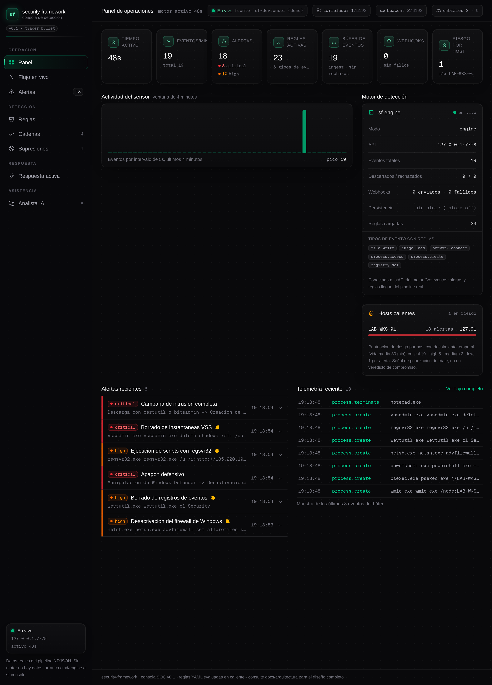

---

## Table of contents

- [Why security-framework](#why-security-framework)
- [Features](#features)
- [Architecture](#architecture)
- [Quickstart (tracer bullet)](#quickstart-tracer-bullet)
  - [Local HTTP API](#local-http-api)
  - [Persistent storage (SQLite, opt-in)](#persistent-storage-sqlite-opt-in)
  - [Ingest authentication (shared token)](#ingest-authentication-shared-token)
  - [Alert webhook (SIEM/SOAR connector)](#alert-webhook-siemsoar-connector)
  - [SIEM sinks (Elasticsearch / Splunk)](#siem-sinks-elasticsearch--splunk)
  - [External notifications (Slack, Telegram, email)](#external-notifications-slack-telegram-email)
  - [Alert suppressions (operator allowlist)](#alert-suppressions-operator-allowlist)
  - [Alert triage (lifecycle)](#alert-triage-lifecycle)
  - [Host risk scoring (hot hosts)](#host-risk-scoring-hot-hosts)
  - [Beaconing detection (C2 call-home)](#beaconing-detection-c2-call-home)
  - [Active response (kill_process, opt-in)](#active-response-kill_process-opt-in)
- [Configuration reference](#configuration-reference)
- [One-command install (Windows)](#one-command-install-windows)
- [Real telemetry with Sysmon](#real-telemetry-with-sysmon-recommended)
- [Web console (preview)](#web-console-preview)
- [Building the real sensor (Windows)](#building-the-real-sensor-windows)
- [How it compares](#how-it-compares)
- [Detection rules](#detection-rules)
  - [Kill-chain correlation](#kill-chain-correlation)
  - [Rule actions](#rule-actions)
  - [Converting Sigma rules](#converting-sigma-rules)
- [Engine CLI reference](#engine-cli-reference)
- [Development & CI](#development--ci)
- [Measured performance](#measured-performance)
- [Repository layout](#repository-layout)
- [Documentation map](#documentation-map)
- [Roadmap](#roadmap)
- [Contributing](#contributing)
- [License](#license)

## Why security-framework

Most open EDR-style sensors are either hard to extend or hard to integrate. This project bets on three ideas:

1. **Behavior over signatures.** IOCs expire; TTPs persist. Rules model process trees, command lines and handle access — the noise an attacker actually makes.
2. **Offensive provenance.** Every seeded rule corresponds to a technique validated in a lab against its real TTP, and documents the noise it produces on a clean host.
3. **Usability is a security feature.** A detection engine nobody wants to operate detects nothing. NDJSON debugging with netcat, hot-reloaded YAML rules and an OpenAPI-first REST interface come before exotic features.

And one engineering rule that shapes everything else: **no simulated data in the product path.** The console never invents events, the engine degrades loudly instead of silently, and the only scripted piece in the repo is the demo scenario, clearly labeled as such.

## Features

| Area | What you get today |
|------|--------------------|
| **Telemetry** | Rust ETW sensor (Kernel-Process) + Sysmon ingestion path; NDJSON/TCP feed with schema validation and enrichment (user, command line, network context) |
| **Detection** | YAML rules with 17 operators (`eq`, `regex`, `contains_any`, …), hot-reload every 15 s, per-rule MITRE ATT&CK tags and actions; `engine sigma` imports community Sigma rules (deterministic, fail-loud, provenance preserved) |
| **Correlation** | Kill-chain sequencer: named steps across the same host within a time window raise one high-signal campaign alert |
| **Risk scoring** | Severity-weighted per-host score with time decay (half-life 30 min, bounded host map): `hot_hosts` top-5 and `risk_hosts_tracked` in `/api/stats`, `sf_host_risk_score{host=...}` in `/metrics`, hot-hosts panel in the console dashboard |
| **Beaconing** | Behavioral C2 call-home detector over `network.connect` (package A3): coefficient-of-variation regularity per (profile, host, destination), `min_interval` false-positive floor, per-key cooldown, bounded state — conservative profiles ship in `beacons.yaml` and detections flow through the standard alert pipeline (suppressions, triage, store, webhook, console) |
| **Response** | Active response `kill_process` (C3, opt-in): armed only with `-allow-kill` + API token + open audit (otherwise a real `404`), five permission layers, append-only JSONL audit (fsync, 64 MiB ceiling) written before every signal, pidfd/handle process guard with declared `fallback_reason`; alert triage lifecycle (acknowledge / close / reopen with notes, persisted via `-lifecycle`), operator suppressions (rule/host, expiry, hot-reload), alert webhook with Bearer auth and bounded retries, external notifications to Slack / Telegram / email with per-channel severity floors (C2) |
| **API** | Local REST API with OpenAPI 3.0 spec (drift-guarded in CI), SSE live stream, filters, JSONL/CSV export with formula-injection neutralization |
| **Console** | Live feed, KPI dashboard, severity triage with free-text search, rule browser, kill-chain chains view, suppressions view, read-only active-response view with its forensic audit trail (attempt-class filter, operator-controlled tail window, JSONL export), AI analyst (bring-your-own OpenAI-compatible endpoint) |
| **Storage** | Opt-in SQLite persistence (`-store`): events and alerts outlive restarts, retention pruner, lists and exports read the full history |
| **Auth** | Shared-token ingest handshake (constant-time), zero-downtime token rotation window, optional Bearer on the API and on outbound webhooks |
| **Ops** | One-command Windows installer (six commands on PATH), Docker image for the engine, GitHub Actions CI on every push |

## Architecture

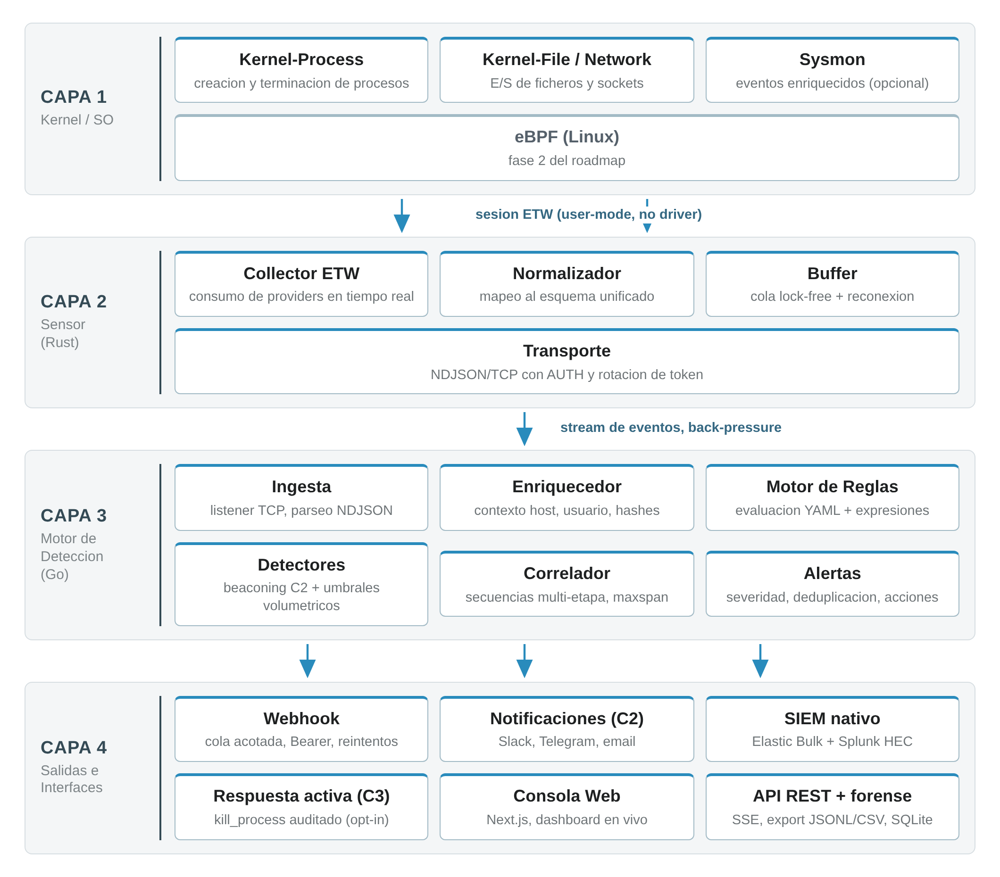

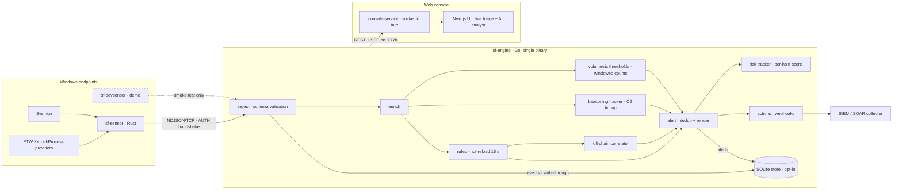

The unified event schema (chapter 4 of the docs) is the master contract: sensors emit it, the engine validates and enriches it, rules index it, interfaces consume it.

Full write-up: [docs/arquitectura-tecnica-v0.9.pdf](docs/arquitectura-tecnica-v0.9.pdf) (Spanish). The v0.9 revision reflects the implemented and verified state — authenticated ingest, all four detection packages (risk, thresholds, beaconing, Sigma import) with the rules-loader house caps and the unified `i*` folding semantics, the C2 external notifications and the native Elasticsearch/Splunk SIEM sinks, the audited C3 active response with its read surface (`GET /api/respond/state`, `GET /api/respond/audit`) rendered in the console — now with forensic operability: attempt-class filter (executed / denied / followups), an operator-controlled 100/500 tail window and a client-side JSONL export of the visible tail — plus its dual kill mechanism (pidfd with declared `fallback_reason` on Linux, handle on Windows) carrying the permanent CI behavioral certification, real lab captures of the respond view embedded as Figures 3 and 4 (12 genuine audit lines, complete F1 pair), the export API, the OpenAPI spec (15 routes / 36 stats fields / 74 resolved refs, guard self-test included), the alert webhook, the two-pass nightly bench (rings vs. SQLite store), the opt-in SQLite store and the Next.js console — with the console-battery floors updated to the two-suite state (19 tests / 58 assertions; the triage-write suite landed by the 20h50 coverage wave, cross-review certified) — and keeps an honest roadmap-status column with cited provenance; [`docs/README.md`](docs/README.md) tracks what remains design-only (YARA, gRPC, filaments, eBPF). It is produced by the versioned in-tree pipeline (`scripts/arq_v04/`), so each revision is a reproducible command rather than a hand edit. The v0.1 design document and the v0.2/v0.3/v0.4/v0.5/v0.6/v0.7/v0.8 revisions are kept for provenance.

## Quickstart (tracer bullet)

Requirements: Go 1.22+.

```bash
# terminal 1 — start the engine
make run-engine

# terminal 2 — replay the demo scenario (simulated data, smoke test only)
make run-devsensor
```

Representative output on the engine terminal (the rule pack grows over time, so the counts reflect the current state of `rules/`):

```
[ENGINE] 23 rules loaded from ./rules (types: [file.write image.load network.connect process.access process.create registry.set])
[ENGINE] 4 sequences loaded from ./sequences (correlator on: [Campana de robo de credenciales Campana de intrusion completa Apagon defensivo Instalacion de persistencia])
[ENGINE] 2 beacon profiles loaded from ./beacons.yaml (beaconing detection on: [C2 beacon rapido C2 beacon web lento])
[ENGINE] 2 threshold definitions loaded from ./thresholds.yaml (volumetric detection on: [Fuerza bruta a servicios remotos Rafaga de escrituras en carpeta publica])
[ENGINE] listening on 127.0.0.1:7777 (NDJSON, 1 event per line)
[ENGINE] api on 127.0.0.1:7778 (stats / events / alerts / rules / stream)
[ALERT] HIGH     9f31c2a4... powershell.exe -nop -w hidden -enc SQBF... host=LAB-WKS-01
[ALERT] HIGH     c1d24e9b... certutil.exe -urlcache -split -f https://... host=LAB-WKS-01
[ALERT] CRITICAL 5b7e1f38... rundll32.exe C:\Windows\...\comsvcs.dll, MiniDump... host=LAB-WKS-01
[ALERT] HIGH     e8a1c72d... schtasks.exe /create /tn MicrosoftEdgeUpdaterCore... host=LAB-WKS-01
[ALERT] HIGH     f3b2d98e... wmic.exe /node:LAB-WKS-02 process call create... host=LAB-WKS-01
[ALERT] CRITICAL a7c4e5f1... powershell.exe -c Set-MpPreference -DisableRealtimeMonitoring... host=LAB-WKS-01
[ALERT] CRITICAL b8d5f6e2... vssadmin.exe delete shadows /all /quiet host=LAB-WKS-01
```

Each alert is also emitted as a structured JSON line for downstream consumers (SIEM connectors, the web console).

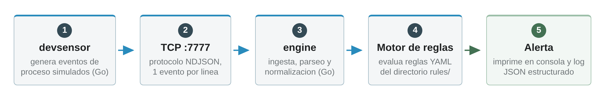

### Docker

```bash
make docker-build
docker run --rm -p 7777:7777 -p 7778:7778 security-framework-engine
```

The image is built from the repo `Dockerfile` (Go 1.22 builder, alpine
runtime, non-root user) and exposes TCP 7777 (NDJSON ingest) and 7778
(HTTP API, bound to `0.0.0.0` inside the container so a console on the
host can reach it). Replay the demo scenario against the container from
the repo root:

```bash
go run ./cmd/devsensor -addr 127.0.0.1:7777
```

For anything beyond a local lab, set a token and publish the ports
deliberately: see [Ingest authentication](#ingest-authentication-shared-token).

### Build from source

```bash
make build          # produces bin/engine and bin/devsensor
./bin/engine        # same behavior as make run-engine
./bin/devsensor     # same behavior as make run-devsensor
```

Other Makefile targets: `make test` (Go unit tests), `make vet`,
`make fmt`, `make build-sensor` / `make build-sensor-windows` (Rust
sensor), `make docker-build`, `make console-install`,
`make console-service` and `make console`.


### Local HTTP API

The engine serves a small read-only API used by the web console and handy for SIEM taps. Both the ingest port and the API bind to `127.0.0.1` by default: the feed carries sensitive host data (users, command lines) and the NDJSON ingest must stay unauthenticated only on loopback, so nothing should be reachable from other machines unless you decide so. To accept sensors running on different hosts, start the engine with `-addr 0.0.0.0:7777` (and `-api 0.0.0.0:7778` if the console is remote too), enable the shared-token auth ([next section](#ingest-authentication-shared-token)), open the port with the installer's `-Firewall` switch, and plan a network-level restriction to the sensor segment. The API can be disabled entirely with `-api 0`:

| Endpoint | Returns |
|----------|---------|
| `GET /api/health` | liveness + mode |
| `GET /metrics` | the same counters as `/api/stats` in the Prometheus text exposition format (`sf_*` families, `text/plain; version=0.0.4`) — scrapers read the credential from their `authorization` config; see [Prometheus](#prometheus-metrics) |
| `GET /api/stats` | uptime, counters, per-severity totals, rule count, ingest auth rejections, webhook delivery counters, per-platform SIEM sink counters (`elastic_*` / `splunk_*`), per-channel external notification counters (`notify_channels`), active suppressions, kill-chain correlator observability (`correlator_states` / `correlator_sequences` / `correlator_cap`), store counters (`store_enabled` / `store_events` / `store_alerts`) |
| `GET /api/events?limit=200` | recent events, newest first |
| `GET /api/alerts?limit=100` | recent alerts, newest first |
| `GET /api/suppressions` | operator allowlist currently active; `POST`/`DELETE` (only with `-api-write`) edit the same file atomically — see [Alert suppressions](#alert-suppressions-operator-allowlist) |
| `POST /api/respond/kill` | active response (C3, opt-in): kill one verified local process, operator-invoked; exists only with `-allow-kill` + API token + open audit (otherwise a real `404`) — see [Active response](#active-response-kill_process-opt-in) |
| `GET /api/respond/state` | armed state of the active-response surface: live allowlist/protected counts, the paths armed at startup and the audit file size against its 64 MiB ceiling; same real-`404` contract as the kill route |
| `GET /api/respond/audit?limit=100` | tail of the `-respond-audit` JSONL (executed AND denied attempts, newest first) with honest scan bookkeeping (`skipped`/`truncated`); hard cap 500; same real-`404` contract |
| `GET /api/sequences` | kill-chain sequences loaded by the correlator (read-only view; empty = correlator off) |
| `GET /api/events/export?format=jsonl\|csv` | bulk download of the event history — in-memory ring, or the full SQLite history with `-store` (JSON Lines or CSV) |
| `GET /api/alerts/export?format=ndjson\|csv&limit=256` | downloadable alert feed for SIEM/SOAR handoff, chronological order |
| `GET /api/rules` | live rule set (hot-reload aware) |
| `GET /api/stream` | Server-Sent Events with live events + alerts |

All four telemetry endpoints (`/api/events`, `/api/alerts` and both `/export` variants) accept the same filter parameters, applied BEFORE `limit`: `host=<name>` (exact, case-insensitive), `since=`/`until=` (RFC 3339 timestamp or positive duration like `90m`/`24h`), `q=<free text>` (case-insensitive across ids, summaries, tags and context), plus `severity=a,b` and `rule_id=` on the alert endpoints and `type=` on the event ones. Invalid values answer 400 with an actionable message. When `-store` is attached, all four read the full stored history — not just the in-memory rings — subject to the configured retention (what that mode changes in [Persistent storage](#persistent-storage-sqlite-opt-in)). Examples: `/api/alerts/export?host=lab-wks-01&since=24h` for "that box, today", `/api/events?type=network.connect&q=suspicious.tld` to chase one domain.

Exports are for SIEM import, offline analysis and the forensic store: JSONL round-trips the full records, CSV flattens them to stable columns and neutralizes spreadsheet formula injection on attacker-controlled fields. When `-webhook` is set, `/api/stats` additionally reports `webhook_sent` / `webhook_failed` / `webhook_dropped` so the delivery pipeline can be sized from the outside; the same delivery triple is reported per SIEM platform when its sink is configured (`elastic_*` via `-elastic`, `splunk_*` via `-splunk`, semantics in [SIEM sinks](#siem-sinks-elasticsearch--splunk)); when `-notify` is set, one `notify_channels` row per configured channel reports the same four-state accounting (sent / failed / dropped / filtered) with the channel name and type; with ingest auth active (`-token`), `ingest_rejected` counts connections rejected by the shared-token handshake; when a `sequences/` directory is loaded, `correlator_states` / `correlator_sequences` / `correlator_cap` expose the kill-chain correlator's in-flight (sequence, host) chains against its hard cap (what the numbers mean and how the console surfaces them in [Kill-chain correlation](#kill-chain-correlation)); and with `-store` attached, `store_enabled` / `store_events` / `store_alerts` report the persisted history size (semantics in [Persistent storage](#persistent-storage-sqlite-opt-in)); `risk_hosts_tracked` / `hot_hosts` always report the per-host risk surface (semantics in [Host risk scoring](#host-risk-scoring-hot-hosts)), and `beacons_tracked` / `beacons_cap` / `beacons_fired` the beaconing detector's live signal (semantics in [Beaconing detection](#beaconing-detection-c2-call-home)). The machine-readable contract for the whole surface lives in OpenAPI 3.0 at [`docs/api/openapi.yaml`](docs/api/openapi.yaml).

The API can demand a bearer token: start the engine with `-api-token '...'` (or `SF_API_TOKEN`) and every `/api/*` route — stats, events, alerts, rules, sequences, suppressions, stream, exports — answers `401` without a valid `Authorization: Bearer <token>` header, with a loud log line per rejected request. `/metrics` is gated by the same credential, and `/api/health` stays open on purpose: it is the liveness probe the engine, the console bridge and uptime checks rely on, and it reveals nothing but `{"mode":"engine","status":"ok"}`. The console-service bridge honors the same `SF_API_TOKEN` variable, so a token-protected console stack needs exactly one extra environment entry. This follows the same standard as the ingest auth: loopback stays friction-free by default, but a listener reachable beyond loopback must never serve telemetry without an explicit credential.

### Prometheus metrics

`GET /metrics` serves the same counters as `/api/stats` in the Prometheus text exposition format (`text/plain; version=0.0.4`), one `sf_*` family per numeric stats field — `sf_events_total`, `sf_alerts_total`, `sf_events_dropped_total`, `sf_ingest_rejected_total`, `sf_webhook_*_total`, `sf_elastic_*_total`, `sf_splunk_*_total`, `sf_notify_{sent,failed,dropped,filtered}_total{channel=...}`, `sf_suppressions_active`, `sf_store_*`, `sf_correlator_*`, `sf_risk_hosts_tracked`, plus the labeled families `sf_alerts_by_severity{severity=...}` and `sf_host_risk_score{host=...}` (top-5 host risk, labels sorted and escaped like the severity series). It is rendered from the same snapshot struct the JSON endpoint serves (a parity test pins both views together), so it reveals nothing `/api/stats` does not, and the non-numeric fields (`rules_types`, `mode`) are deliberately omitted to keep series cardinality out of operator-file control. Scraping a token-protected engine works with the standard `authorization` scrape option:

```yaml
scrape_configs:
  - job_name: security-framework
    metrics_path: /metrics
    authorization:
      credentials: <SF_API_TOKEN>
    static_configs:
      - targets: ['127.0.0.1:7778']
```

Worth alerting on: `sf_ingest_rejected_total` climbing (a probe against the ingest port), `sf_webhook_failed_total` climbing (a down SIEM connector), `sf_elastic_failed_total` / `sf_splunk_failed_total` climbing (a misconfigured or saturated SIEM sink), `sf_notify_failed_total` climbing (a dead chat or mail channel — the alert still fires, the operator just stops seeing it), and `sf_correlator_states` reaching `sf_correlator_cap` (a feed problem flooding the kill-chain tracker — see [Kill-chain correlation](#kill-chain-correlation)).

### Persistent storage (SQLite, opt-in)

By default the engine keeps recent telemetry in bounded in-memory rings (1000 events / 256 alerts) and that is all the API serves. Start it with `-store` to persist every event and alert to a SQLite database (pure-Go driver, WAL journalling — the Docker image and every CI job stay cgo-free):

```bash
sf-engine -store ./sf-store.db                     # retention defaults to 72h
sf-engine -store ./sf-store.db -store-retention 0  # keep everything, prune nothing
```

While the store is attached:

- The telemetry lists (`/api/events`, `/api/alerts`) and both `/export` endpoints read the **full stored history** (same filters, same wire format, subject to the configured retention) instead of the rings, so `since=24h` reaches beyond the 1000-event window. The SSE stream and the console keep their live behavior unchanged.
- `/api/stats` reports `store_enabled`, `store_events` and `store_alerts` — the counts survive a restart, because the history does: kill the engine, start it again on the same file, and the API serves everything it persisted.
- Rows older than `-store-retention` (default 72h; `0` keeps everything) are pruned on a 5-minute ticker, loudly when something is removed.
- The database (and its WAL side files) is created `0600` — full telemetry (users, command lines, file paths) must not be readable by other local users. A file that already exists keeps its mode (no surprise permission changes; tighten it yourself if it predates this change).
- A store that cannot be opened is a FATAL startup error, by the same standard as a malformed suppressions file: persistence you believe is armed must not silently stay off. Write failures at runtime are logged with a throttle and never stop detection.

### Ingest authentication (shared token)

The NDJSON ingest supports a shared-token handshake for deployments where sensors connect over the network. Start the engine with `-token` or the `SF_INGEST_TOKEN` environment variable (flag wins):

```bash
sf-engine -addr 0.0.0.0:7777 -token 'pick-a-long-random-secret'
# or:  export SF_INGEST_TOKEN=...  and just run sf-engine
```

Every connection must then send `AUTH <token>` as its FIRST line (before any event) and receive `{"ack":"ok"}`. All bundled sensors honor it:

| Sensor | How to pass the token |
|--------|-----------------------|
| `sf-engine` | `-token <t>` flag or `SF_INGEST_TOKEN` env |
| `devsensor` (Go demo) | `-token <t>` flag or `SF_INGEST_TOKEN` env |
| `sf-sensor` (Rust/Sysmon) | `--token <t>` flag or `SF_INGEST_TOKEN` env |
| `sf-devsensor` (PowerShell demo) | `-Token <t>` param or `SF_INGEST_TOKEN` env |

Mismatch behavior is loud on purpose: a sensor with a stale token is closed with a clear `{"ack":"error",...}` message, a sensor sending `AUTH` to a token-less engine is closed too, and a silent client that never authenticates is dropped after 10 seconds. The comparison is constant-time. Loopback-only deployments without a token keep working exactly as before (auth disabled); a non-loopback bind without a token prints a startup warning, because any host that reaches the port could then inject events.

**Rotating the token without downtime.** The token is static per process, so rotation uses a two-token window: restart the engine once with BOTH tokens, redeploy the sensors with the new one, then restart the engine a final time with only the new token:

```bash
# 1) open the rotation window: current AND previous token both accepted
sf-engine -token 'the-new-secret' -token-previous 'the-old-secret'
# or:  SF_INGEST_TOKEN_PREVIOUS=the-old-secret  (flag wins)

# 2) redeploy sensors with the new token (any order, zero downtime:
#    sensors still on the old token keep streaming during the window)

# 3) close the window: restart the engine without -token-previous
sf-engine -token 'the-new-secret'
```

During the window the startup banner says `rotation window OPEN` so an operator can see at a glance when a migration is still in progress. Both comparisons are constant-time and combined without branching on the content, so the window does not leak which token matched.

On Windows the installer can persist the token for you (`install.ps1 -IngestToken '...'`, stored under `tools\config\ingest.token`, cleared with an empty value): the autostart entry, `sf-console` and `sf-devsensor` then all start the engine with that token enforced. The installer's `-Firewall` switch **requires** a configured token — it refuses to open TCP 7777 otherwise (and removes a rule left behind by a pre-gate install), because a reachable ingest without a token is an open event-injection channel for the whole network segment.

### Alert webhook (SIEM/SOAR connector)

The engine can push every raised alert as JSON to an external HTTP collector — a SIEM, a SOAR playbook, a chat-ops relay:

```bash
bin/engine -addr :7777 -webhook http://siem.internal:8080/ingest
```

Delivery is asynchronous and bounded: alerts queue up to 512 frames, a single worker POSTs them with up to three attempts (transport errors, 429 and 5xx retry; other 4xx fail fast) and a slow or down receiver never blocks detection — saturated deliveries are counted as dropped instead. The payload is the same structured alert the console and the JSON log line carry, so receivers speak one format. When the connector is active, the console header shows a delivery chip (`webhook N / err / desc`) fed by the same counters `/api/stats` exposes, so a silently down SIEM is visible at a glance.

**Outbound auth.** In shared networks the receiver should be able to verify who is POSTing — and a leaked URL alone must not be enough to inject alerts into your SIEM. Add a Bearer token, sent on every delivery (retries included):

```bash
bin/engine -webhook http://siem.internal:8080/ingest \
           -webhook-token 'pick-another-long-secret'
# or:  export SF_WEBHOOK_TOKEN=...  (flag wins)
```

The receiver then validates the `Authorization: Bearer` header, so a receiver reachable from more than the engine's host can reject unauthenticated or spoofed posts instead of ingesting fake alerts into the SIEM. Per-rule `actions.webhook` entries keep their own independent `secret` config (see [Rule actions](#rule-actions)); when both are set the per-action secret applies to that action only and the global token to the engine-level connector. A webhook running without any token prints a startup reminder listing the flag and the env var.

### SIEM sinks (Elasticsearch / Splunk)

For teams that run their detections straight into a SIEM platform — no relay endpoint of their own to build — the engine ships native sinks for Elasticsearch and Splunk:

```bash
# Elasticsearch: alerts bulk-indexed into a daily index
bin/engine -elastic http://elastic.internal:9200 \
           -elastic-api-key 'base64-of-your-api-key'      # or SF_ELASTIC_API_KEY

# Splunk: alerts POSTed as HEC events to the collector
bin/engine -splunk https://splunk.internal:8088 \
           -splunk-token 'your-hec-ingestion-token'       # or SF_SPLUNK_TOKEN
```

Both sinks run in parallel with the webhook and share its delivery discipline: a bounded 512-alert queue, a single worker, three attempts with linear backoff, transport errors / 429 / 5xx retried and everything else failed fast — a slow platform never stalls detection, and every sent / failed / dropped alert is counted per platform in `/api/stats` (`elastic_sent` / `elastic_failed` / `elastic_dropped`, `splunk_*`) and as `sf_elastic_*_total` / `sf_splunk_*_total` in `/metrics`. The example endpoints spell their scheme on purpose: both credentials travel in headers (`Authorization: ApiKey`, `Authorization: Splunk`), so an `http://` endpoint leaks no secret — but the alert bodies themselves cross the wire in the clear, which is fine for a trusted lab LAN and is exactly why anything routed over a network you do not control should be `https://`.

The Elasticsearch sink speaks the real Bulk API: NDJSON meta/doc pairs, `application/x-ndjson`, `Authorization: ApiKey`, one request per batch (up to 64 alerts or one flush window). Documents land in `<index>-YYYY.MM.DD` (UTC, `-elastic-index` to change the prefix, default `sf-alerts`) so retention follows the operator's index lifecycle instead of a single ever-growing index — and each document carries the alert ID as its `_id`, which makes retries idempotent: an ambiguous transport failure re-indexes the same document instead of duplicating it. The bulk answer is always parsed, because a 200 can still carry per-item rejections (mapping errors count as failed immediately, 429/5xx items are retried alone).

The Splunk sink speaks the HTTP Event Collector: one event per POST to `/services/collector/event` with `Authorization: Splunk <token>`, the full alert as the event body, and the alert's `time` (epoch seconds), `host`, `source` and `sourcetype` (`sf:alert`) at HEC level; `rule_id`, `severity`, `host` and `user` also travel as indexed `fields` so Splunk admins can search and alert on them without parsing the payload. Success requires both an HTTP 2xx AND a zero ack code — HEC reports rejected events as 200-with-code, and those are permanent failures, not retries.

Delivery semantics are at-least-once on both paths (the Elasticsearch `_id` makes them effectively deduplicated; HEC has no client-side event key, so downstream dedup can key on the alert `id` every event carries). The end-to-end delivery contract — wire shapes, auth enforcement, negative control and wrong-credential visibility — is pinned by `scripts/dev-tests/e2e_siem.sh` with its labeled lab receivers.

### External notifications (Slack, Telegram, email)

The webhook speaks JSON to machines; `-notify` speaks human to the on-call. One YAML config file arms any combination of chat and mail channels, and every raised alert — the same stream the webhook and the console see — fans out to each channel without ever blocking detection:

```bash
bin/engine -notify /etc/security-framework/notify.yaml
```

```yaml
channels:
  - type: slack
    name: soc-slack              # label for stats/metrics; defaults to the type
    url: https://hooks.slack.com/services/T000/B000/XXXX
    min_severity: high           # optional floor: info < low < medium < high < critical
  - type: telegram
    token_env: SF_TG_BOT_TOKEN   # secrets resolve from the environment (literal token also accepted)
    chat_id: "-100123456789"
  - type: email
    server: smtp.internal:587
    from: sf-alerts@corp.example
    to: ["soc@corp.example", "oncall@corp.example"]
    username_env: SF_SMTP_USER
    password_env: SF_SMTP_PASS
    starttls: true               # the default: the engine refuses to downgrade to cleartext
```

Delivery follows the same discipline as the SIEM webhook: one bounded queue (256) and worker per channel, three attempts with linear backoff (transport errors, 429 and 5xx retry; definitive 4xx fail fast), and a dead channel never touches detection — its frames are counted instead. Every channel reports `sent` / `failed` / `dropped` / `filtered` on `/api/stats` (`notify_channels`) and as the labeled families `sf_notify_*_total{channel=...}` on `/metrics`; `filtered` is the operator-configured silence of a `min_severity` floor, reported as data rather than hidden.

Email transport is deliberate about plaintext: STARTTLS defaults to **on** and a relay that does not offer it is a loud startup-and-delivery refusal, not a silent downgrade; AUTH PLAIN never sends credentials over an unencrypted connection (the net/smtp loopback exception is what makes local relays testable). Chat message bodies carry the rendered human line `[SEVERITY] rule @ host — summary`; email additionally carries the full structured alert in the body so the mailbox doubles as a forensic record. The config loader is fail-loud at startup (unknown channel type, missing endpoint, unresolved secret env var, duplicate names, more than 8 channels, file above 4 MiB all stop the engine), because a notification channel that silently never fires is a silent control. The same deliberateness has a boundary the operator should know: the loader accepts `http://` for Slack and Telegram endpoints (self-hosted relays and lab LANs are legitimate), but a Slack hook URL *is* the credential and the Telegram token travels inside the request path — on any network you do not control, keep both on `https://` (their public defaults already are) so the secret never crosses the wire in cleartext.

### Alert suppressions (operator allowlist)

Maintenance windows and accepted exceptions happen: sometimes an alert is correct and still unwanted. `suppressions.yaml` (see `suppressions.example.yaml` for the annotated format) silences a rule, a host, or a rule+host pair, with optional RFC 3339 expiration. The full operator guide to alert noise — dedup semantics, suppression recipes, correlation volume, receiver-side filtering and the pipeline's abuse-resistance caps — lives in [`docs/false-positive-control.md`](docs/false-positive-control.md):

```yaml
- rule_id: vss-delete
  host: LAB-WKS-01
  reason: "approved change window INC-1234 (backup migration)"
  expires: 2026-10-05T06:00:00Z
```

Point the engine at it with `-suppressions <path>` (default `./suppressions.yaml`, falling back to the install root like the rules directory). The file hot-reloads on the same 15 s ticker as rules and sequences: editing it is enough, no restart. Semantics worth knowing:

- A suppressed hit raises NO alert, does NOT reach the webhook, and does NOT feed the kill-chain correlator — a host with a silenced rule is treated as being in an accepted state. Each suppressed hit is logged as `[SUPPRESS] rule=<id> host=<host>`, never silently.
- An entry without `expires` stays active until you remove it; expired entries stop matching on their own.
- A malformed file is FATAL at startup (a typo must not disable a control you believe is armed) and rejected — keeping the previous set — on hot reload, loudly.
- The live set is observable at `GET /api/suppressions` and counted in `/api/stats` (`suppressions_active`).
- **API writes are opt-in**: an engine started with `-api-write` (or `SF_API_WRITE=1`) also answers `POST /api/suppressions` (add/update one entry, keyed by the rule_id+host pair) and `DELETE /api/suppressions?rule_id=…&host=…` (exact-pair removal, `404` when nothing matched). Writes go through the same validation as the YAML loader, land on the file atomically (temp + rename, preserving its mode) and are loaded back immediately — the file stays the single source of truth, so hand edits and API edits never diverge. Without the flag both routes answer `403` naming it; beyond loopback, arming is refused at startup unless `-api-token` is set. Every write logs an audit line (`WRITE suppressions add rule=… host=… by=api`) with control characters %XX-escaped, so a hostile request cannot forge engine-log lines. Hard caps shared by the API and the YAML loader bound one hostile or careless request: fields (`rule_id` 128, `host` 253, `reason` 2000 characters), 8 KiB per request body and 1000 entries per file (hand edits of the file are not capped — you already hold the pen). Contract details: [`docs/api/openapi.yaml`](docs/api/openapi.yaml).

### Alert triage (lifecycle)

Detecting is only half of the job — the other half is working the queue. Every alert carries a unique engine-assigned `id`, and the operator triage state travels with it:

```bash
# acknowledge an alert, with an optional note
curl -X POST http://127.0.0.1:7778/api/alerts/<id>/status \
  -H 'Content-Type: application/json' \
  -d '{"status":"acknowledged","note":"visto, investigando","by":"ana"}'

# close it, reopen it ("new"), same endpoint — statuses: new, acknowledged, closed
```

`GET /api/alerts` merges the current status into every alert (`status`, `status_note`, `status_by`, `status_at`), a `alert_lifecycle` SSE frame announces each decision live, and the web console renders the status chips plus the reconocer/cerrar/reabrir actions in the alert panel (the write goes console → hub → engine; the API token never leaves the hub). The API token gates the write endpoint exactly like every read endpoint.

Statuses persist across engine restarts with `-lifecycle <file>` (default `./alert-lifecycle.json`, falling back to the install root; `-lifecycle ""` keeps them in memory only). The file is written atomically on every decision and is FATAL to load if malformed — the same fail-loud standard as suppressions: triage work silently resetting to "new" would be a lie. One honest note on restarts: without `-store` the alert ring is in-memory, so after a restart the file preserves the audit record while the alerts it refers to are gone. With the SQLite store attached, alerts are served from the persisted history after a restart (see [Persistent storage](#persistent-storage-sqlite-opt-in)), so alert and lifecycle persist together and the triage status stays visible end to end.

### Host risk scoring (hot hosts)

Running alongside triage, the engine keeps a per-host risk score: every alert adds a fixed severity weight to its host's score — critical 10, high 5, medium 2, low 1, info 0 — and the total halves every 30 minutes without new alerts (a one-critical host is gone from the board in about three hours). `/api/stats` serves the top five as `hot_hosts` (host, score rounded to 2 decimals, alert count, last-seen) plus a `risk_hosts_tracked` count, `/metrics` renders `sf_host_risk_score{host=...}` next to `sf_risk_hosts_tracked`, and the console dashboard shows the leaders with their decay. Two deliberate design lines: the tracker's state is bounded (`MaxHosts`, coldest-evicted-first — a hostile feed inventing hostnames cannot wash out a genuinely hot one), and the score models what the engine SAW, never what the operator decided — acknowledging or closing an alert does not refund points, because queue priority and detection heat answer different questions.

### Beaconing detection (C2 call-home)

The engine also ships a behavioral detector that no single-event rule can express: beaconing. For every (profile, host, destination) triple it keeps the last 64 connection timestamps inside the profile's sliding window and measures the regularity of the inter-arrival intervals with the coefficient of variation (stddev/mean): implants sleep on a schedule, human browsing does not. When at least `min_count` connections show a CV at or under `max_jitter` with a mean interval of at least `min_interval`, exactly one alert fires — naming the destination, the observed cadence and the measured jitter, so an analyst can reproduce the verdict by hand.

Profiles live in `beacons.yaml` (committed and loaded by default; `-beacons ""` turns the detector off; a file that exists but does not parse is FATAL at startup — the same fail-loud standard as suppressions). The shipped pack is deliberately conservative: the web profile needs 12 regular connections inside a 15-minute window with a mean interval of at least 2 s — CDNs, load balancers and NTP pools are regular too, but at sub-second cadences the `min_interval` floor keeps that chatter out by construction. Detections honor the rest of the pipeline for free: profile+host suppressions, triage lifecycle, store, webhook and console, because a beacon alert is just another alert (its `rule_id` is the profile's id). The tracker's state is bounded (8192 keys, weakest-evicted-first — a flood of one-connection fake destinations can only evict other flood entries, never wash out evidence that is building), and re-fires are throttled per key by the profile's `cooldown`. `/api/stats` exposes the live signal (`beacons_tracked` / `beacons_cap` / `beacons_fired`) and `/metrics` the same families as `sf_beacon_keys_tracked` / `sf_beacon_cap` / `sf_beacons_fired_total`. The console header carries the same signal as a `beacons N/cap` chip — red the moment the cap is reached (new destinations silently stop being tracked, which is detection loss on a flooded feed) — next to the `umbrales N · M` chip that keeps the volumetric thresholds detector (A2) visible the same way, fed by `threshold_rules` / `threshold_keys` / `threshold_fired`.

### Active response (kill_process, opt-in)

The engine can act, not just detect — and the action is the most
heavily gated surface in the project (roadmap C3, iteration 1: local
`kill_process` only). An engine started with `-allow-kill` **plus** an
API token **plus** an open audit file arms `POST /api/respond/kill`:
one verified process on the engine's own host, terminated with a fixed
SIGKILL on behalf of a named human operator. Without any of the three,
the route answers a real `404` — there is no surface to probe.

Five permission layers run before every signal, and every well-formed
attempt (denied included) is written to the `-respond-audit` JSONL
**before** the signal, with fsync and a 64 MiB ceiling: the action that
cannot be proven to have happened, does not happen. The operator must
be on the `-respond-operators` allowlist; the `host` field must equal
the engine's own hostname (a console replaying a REMOTE sensor's alert
gets `host_mismatch`, never a local kill); budgets cap committed
actions (60 s cooldown per host+pid, 20/min global, 6/min per
operator); and the process guard kills the VERIFIED object, not the
number — pidfd pinning on Linux and a single verified handle on
Windows (`mechanism` in the response), with the real process name
checked per platform before anything is sent. When the Linux kernel
predates pidfd (or the syscall is blocked), the engine degrades to the
classic fallback — re-verifying the name immediately before the signal
— and the degradation is loud AND diagnosable: `fallback_reason`
carries the errno name that defeated `pidfd_open` in the response and
in the audit followup (`enosys` = old kernel, permanent and expected;
`emfile`/`enfile` = fd exhaustion of a mechanism that was alive,
transient and worth watching). PID 0/1/negative,
self/ancestor, and protected names (Windows defaults: csrss, smss,
wininit, services, lsass; extend with `-respond-protected`) are
refused with their own audit codes.

Two honest limits, in the flag text and the audit: the name check
protects against the mechanical error (wrong PID through recycling),
not against malware disguising its identity — the kill decision
belongs to the operator backed by the alert. And there is NO
automation path: rules, sequences and the correlator cannot reach
this surface; it exists because an operator called it. Contract
details: [`docs/api/openapi.yaml`](docs/api/openapi.yaml).

The surface is also READABLE (console visibility): `GET
/api/respond/state` reports what was armed at startup with LIVE
allowlist counts and the audit file health, and `GET
/api/respond/audit` tails the JSONL — every attempt, executed and
denied, newest first, with the lines that are not records yet counted
instead of hidden. Both extend the §2.1 contract to reads: a disarmed
engine answers a real `404`, so probing learns nothing, and both sit
behind the same bearer credential as every other `/api` read. The web
console renders both in its "Respuesta activa" view — read-only by
design (R8: the kill has no UI trigger).

Verification is three-layered: unit tests exercise both kill paths
against real child processes (native pidfd and forced fallback),
`scripts/dev-tests/e2e_respond_kill.sh` runs the full permission
matrix over real Linux binaries, and CI runs
`scripts/windows/smoke_respond.ps1` on a native Windows runner (job
`engine-windows`): real kills of throwaway processes the smoke itself
spawns, the protected set denied via a decoy `csrss.exe` in temp
(the real one is never touched — the guard refuses before signaling),
and the audit JSONL asserted end to end. The Windows handle path is
verified in conduct, not just in compilation.

## Configuration reference

Everything the engine does is a flag with a safe default; everything secret can also come from the environment. This is the full surface — there are no other knobs:

**Engine flags (`sf-engine`):**

| Flag | Default | Purpose |
|------|---------|---------|
| `-addr` | `127.0.0.1:7777` | NDJSON ingest listener (loopback unless you decide otherwise) |
| `-api` | `127.0.0.1:7778` | local API — read endpoints + the alert triage write (`0` disables it) |
| `-rules` | `./rules` | YAML rules directory (hot-reload aware) |
| `-sequences` | `./sequences` | kill-chain sequences directory (correlator) |
| `-beacons` | `./beacons.yaml` | beacon detector profiles (C2 call-home over `network.connect`; empty disables) |
| `-suppressions` | `./suppressions.yaml` | operator allowlist (hot-reload aware) |
| `-lifecycle` | `./alert-lifecycle.json` | alert triage state file (acknowledged/closed + notes; empty keeps statuses in memory only) |
| `-reload-every` | `15s` | hot-reload cadence for rules/sequences/suppressions (`0` disables) |
| `-token` / `-token-previous` | — | ingest shared token / previous token during a rotation window |
| `-api-token` | — | Bearer required on every `/api/*` route and on `/metrics` (`/api/health` stays open) |
| `-api-write` | off | arm `POST`/`DELETE /api/suppressions` (writes land on the `-suppressions` file; refused beyond loopback without `-api-token`) |
| `-allow-kill` | off | arm `POST /api/respond/kill` (active response, SIGKILL fixed; REQUIRES `-api-token` even on loopback + open `-respond-audit`; falls back to `SF_ALLOW_KILL=1`) |
| `-respond-operators` | `./respond-operators.yaml` | allowlist of operators who may run active response (`{version: 1, names: [...]}`; missing = empty = everything denied; malformed = fatal; hot-reloaded) |
| `-respond-protected` | — | optional extra protected process names merged with the platform defaults (hot-reloaded) |
| `-respond-audit` | `./respond-audit.jsonl` | append-only JSONL audit, one line per attempt, fsync per line, 64 MiB ceiling |
| `-webhook` / `-webhook-token` | — | SIEM/SOAR connector URL / outbound Bearer token |
| `-elastic` / `-elastic-index` / `-elastic-api-key` | — / `sf-alerts` / — | Elasticsearch bulk indexing (daily `-YYYY.MM.DD` index, deterministic `_id`) / index prefix / API key (falls back to `SF_ELASTIC_API_KEY`) |
| `-splunk` / `-splunk-token` | — | Splunk HEC collector base URL (events POSTed to `/services/collector/event`) / HEC token (falls back to `SF_SPLUNK_TOKEN`) |
| `-store` / `-store-retention` | off / `72h` | SQLite persistence / pruning window (`0` keeps everything) |
| `-v` | off | print every event received |
| `-pidfile` | — | write the engine PID to a file |
| `-i`, `--interactive` | off | interactive TUI over the running engine (degrades to the classic flat run without a TTY) — see [Engine CLI reference](#engine-cli-reference) |

**Environment variables:**

| Variable | Component | Purpose |
|----------|-----------|---------|
| `SF_INGEST_TOKEN` | engine + every bundled sensor | ingest shared token (the flag wins when both are set) |
| `SF_INGEST_TOKEN_PREVIOUS` | engine | second accepted token during a rotation window |
| `SF_API_TOKEN` | engine + console-service + web console | one entry protects the API, the bridge and the console proxy (same-origin writes, loopback-only hosts by default) |
| `SF_API_WRITE` | engine | set to `1` to arm the suppression write API (same as `-api-write`; the flag wins) |
| `SF_ALLOW_KILL` | engine | set to `1` to arm active response (same as `-allow-kill`; the flag wins; the token + audit layers still apply) |
| `SF_WEBHOOK_TOKEN` | engine | Bearer on outbound alert deliveries |
| `NO_COLOR` | engine CLI + alert rendering | any non-empty value strips ANSI color from the CLI tables/banner and from rendered alert output; the standard `no-color.org` switch (a non-TTY stdout already strips it) |
| `NEXT_PUBLIC_CONSOLE_URL` | web console | point the UI at a remote hub |
| `NEXT_PUBLIC_ENGINE_API` | web console | direct engine API base for polling (default same-origin proxy `/api/engine`) |
| `CONSOLE_ALLOWED_HOSTS` | web console | comma-separated hostnames the console proxy serves besides loopback (`localhost`/`127.0.0.1`/`::1` are always served); any other `Host` gets a `403` naming this var — the console posture mirrors the engine's: loopback friction-free, beyond loopback loud and explicit |
| `ANALYST_BASE_URL` / `ANALYST_API_KEY` / `ANALYST_MODEL` | console-service | OpenAI-compatible endpoint for the AI triage analyst |
| `PORT` / `CONSOLE_SERVICE_PORT`, `CONSOLE_HOST`, `CONSOLE_CORS_ORIGIN` | console-service | hub networking and allowed origins |

The AI analyst is optional: without the three `ANALYST_*` variables the
analyst panel says so clearly and the rest of the console keeps working.
Details in [`web/console/README.md`](web/console/README.md).

## One-command install (Windows)

From any PowerShell window, no admin account and no prior download required:

```powershell
irm https://raw.githubusercontent.com/Ruby570bocadito/security-framework/main/install.ps1 | iex
```

The installer downloads the repository, provisions portable Go, Node and Bun under your user profile, builds the engine and the web console, and puts six commands on your PATH:

| Command         | What it does                                   |
|-----------------|------------------------------------------------|
| `sf-engine`     | detection engine, prints alerts live           |
| `sf-sensor`     | streams REAL host telemetry through the engine via Sysmon (`-SetupSysmon` installs it in one command) |
| `sf-devsensor`  | demo only: replays a scripted scenario (simulated data, clearly labeled; works under WDAC/Smart App Control) |
| `sf-console`    | starts the web console and opens the browser   |
| `sf-update`     | updates the code and rebuilds                  |
| `sf-uninstall`  | removes everything                             |

## Real telemetry with Sysmon (recommended)

`sf-devsensor` replays a scripted demo scenario (simulated data - the only simulated piece in the project). To detect what actually happens on the machine, set up Sysmon (free Microsoft telemetry driver) with one command - accept the UAC prompt once:

```powershell
sf-sensor -SetupSysmon
```

That installs Sysmon via winget (or finds an existing copy) and applies the bundled `sysmon-config.xml`. Manual equivalent, in an admin terminal:

```powershell
winget install Sysinternals.Sysmon
sysmon -accepteula -i "$env:LOCALAPPDATA\security-framework\scripts\sysmon-config.xml"
```

The shipped `sysmon-config.xml` is tuned to the detection pack and filters classic noise sources (ShimCache, UserAssist, MUICache, CDN DNS...). Then run `sf-sensor` (normal user; elevation or membership in the local `Event Log Readers` group is only needed to read the Sysmon log) and open `sf-console`: the alerts you see now correspond to real host activity - process creation, network and DNS, registry writes, file drops, and LSASS access (credential-dump detection).

Optional switches (parameterized form):

```powershell
& ([scriptblock]::Create((irm https://raw.githubusercontent.com/Ruby570bocadito/security-framework/main/install.ps1))) -WithSensor -AutoStart -Firewall
```

`-WithSensor` also builds the Rust ETW sensor (needs Rust + MSVC Build Tools), `-AutoStart` registers engine and console as logon entries (HKCU Run, no admin required), `-Firewall` opens inbound TCP 7777 for remote sensors (domain and private network profiles only) and asks for elevation via UAC when needed; it only matters when the engine is explicitly started with `-addr 0.0.0.0:7777`, since the default bind is loopback. `-WebhookUrl http://siem.internal:8080/ingest` persists the alert webhook so the engine autostart POSTs every alert there as JSON (re-run with `-WebhookUrl ''` to clear it). Install location defaults to `%LOCALAPPDATA%\security-framework` and can be changed with `-InstallDir <path>`.

To uninstall:

```powershell
sf-uninstall
```

or, from a machine where it is not installed (or the PATH is gone):

```powershell
irm https://raw.githubusercontent.com/Ruby570bocadito/security-framework/main/uninstall.ps1 | iex
```

The uninstaller stops the processes, removes the logon entries (HKCU Run and any legacy scheduled tasks), the firewall rule, the PATH entry and the whole install folder, including the portable toolchains it created. Toolchains you had before are left alone.

## Web console (preview)

The repo ships an early browser console: live telemetry feed, KPI dashboard, severity triage, the YAML rule pack, the kill-chain chains the correlator has armed, operator suppressions, the active-response audit view, and an AI analyst that explains each alert like a senior SOC analyst would. Both the alert queue and the live feed support free-text search (rule, host, user, command line, MITRE tag) on top of the dropdown filters, so triage can narrow down a noisy host or a single technique in seconds. The hub (`web/console-service`) contains NO simulator: it forwards only what the Go engine's API (:7778) really delivers, and the header chip names the actual source of the events you are looking at - `sf-sensor (Sysmon real)` for real host telemetry, or `sf-devsensor (demo)` while the scripted scenario is replaying. If the engine is unreachable the console says so and shows no data, instead of inventing any.

The interface carries a restrained motion layer adapted from [React Bits](https://reactbits.dev) — every effect communicates a state change and none is decoration: a pointer-reactive dot-grid canvas behind the shell, view titles that blur in on section change, KPI halos that follow the mouse, an animated 1px border on the AI analyst while it is working, a gradient pulse on the critical counter while critical alerts exist, a status chip that scales in when a triage decision lands, and a brand tagline that decrypts once on load. Everything respects `prefers-reduced-motion` (static fallbacks) and the whole layer adds zero runtime dependencies beyond `motion`.

Operations dashboard: KPIs, sensor activity, hot hosts, top kill-chain alerts and the live event sample in one view. The KPI strip carries a per-host risk tile (tracked hosts + current leader) and the engine column stacks the hot-hosts panel: the top hosts by decayed score, their bar, and an honest empty state when nothing is hot (the score cools on its own; the capture below shows the panel populated with the risk tile and the hot-hosts bar fed by a real devsensor replay with the beaconing detector fired). The header adds one status chip per detector/delivery surface (webhook delivery, kill-chain correlator, A3 beaconing, A2 volumetric thresholds — hidden while the feature is off, red at saturation), and the engine summary names the real persistence mode (`SQLite · N eventos · N alertas` with `-store`, `sin store` without): if a behavioral detector is armed or the store is attached, the console says so on screen, fed only by `/api/stats`.


Alert triage queue with severity badges, MITRE tags and expandable details. Selecting a row opens the detail panel: the rendered rule message, matched fields, declared actions and enrichment, plus the triage actions (r6) at the end of the panel:

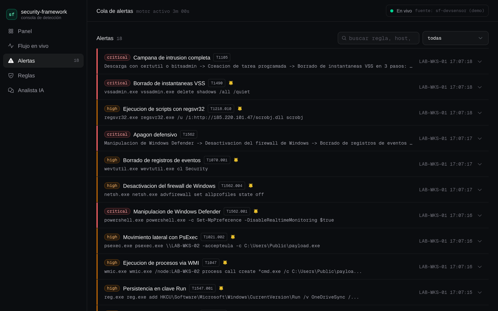

The `Ciclo de vida` section is the operator queue surface: a free-text note and the reconocer / cerrar / reabrir buttons. The decision round-trips console → engine proxy → engine API and every connected console updates live through the `alert_lifecycle` stream — this capture IS the recorded state: the row carries the `reconocida` chip and the panel shows who decided, when, and the note (persisted with `-lifecycle`):

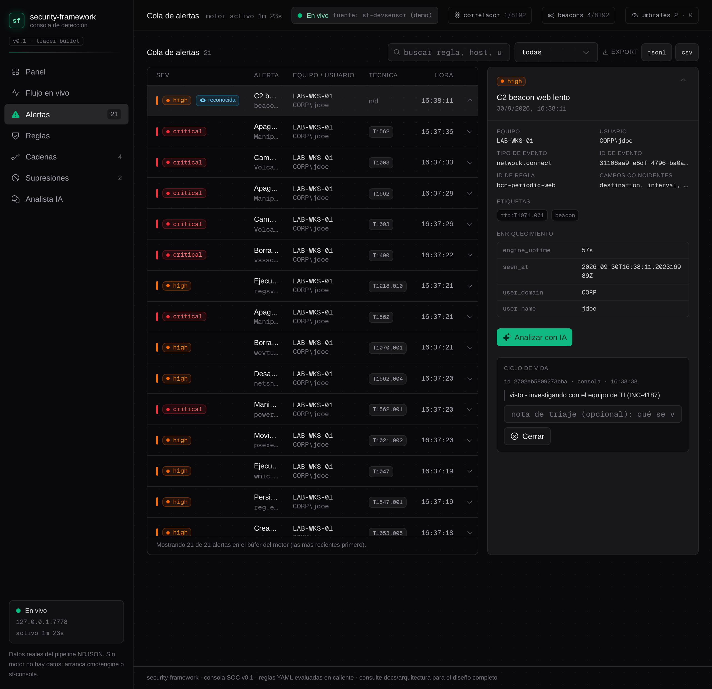

Free-text search on top of the dropdown filters - typing narrows the queue live to the alerts that mention `lsass`:

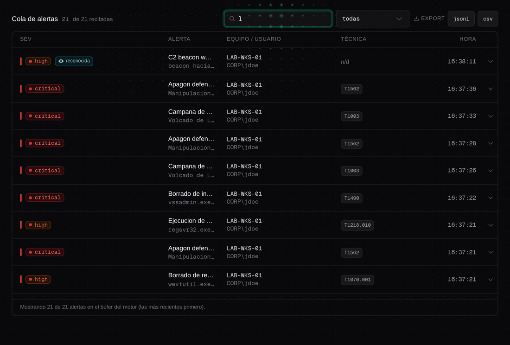

The loaded rule pack, rendered with each rule's conditions and MITRE mapping:

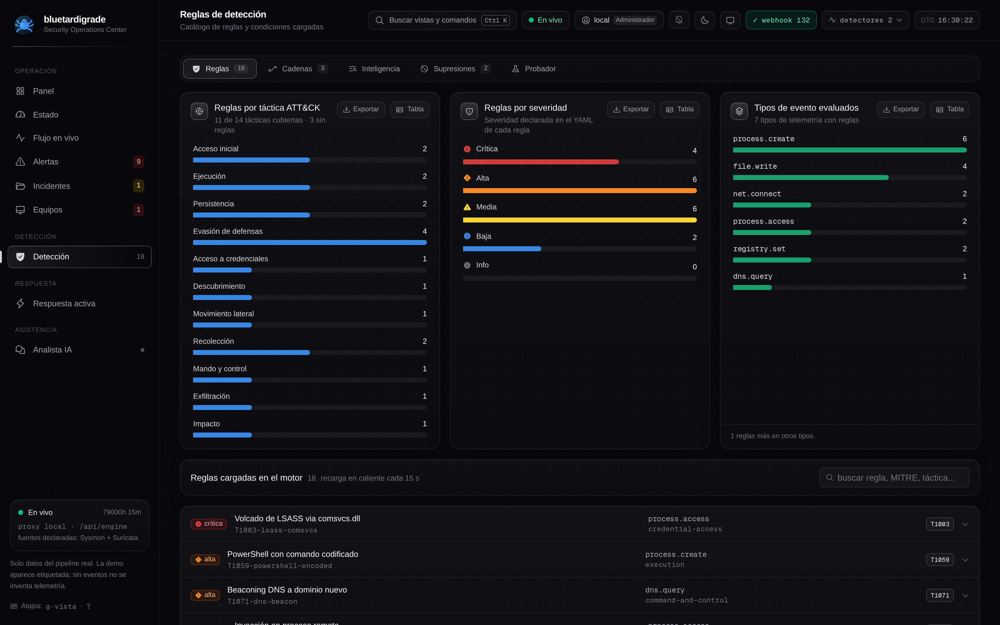

The kill-chain chains the correlator loaded, rendered as connected step chains: emerald connectors when every step's rule is live (the chain can complete and raise its campaign alert), amber nodes for a step waiting on a missing rule:

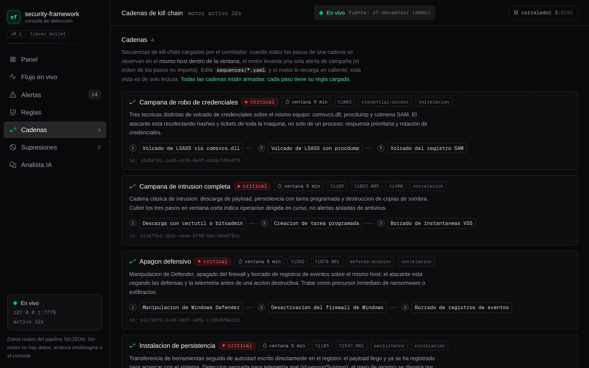

Operator suppressions, rendered read-only with rule-name lookup, host scope, reason and a live expiry countdown — the exact set the engine loaded from `suppressions.yaml` (the nav badge shows the active count; suppressed hits raise no alert, as documented in the suppressions section above):

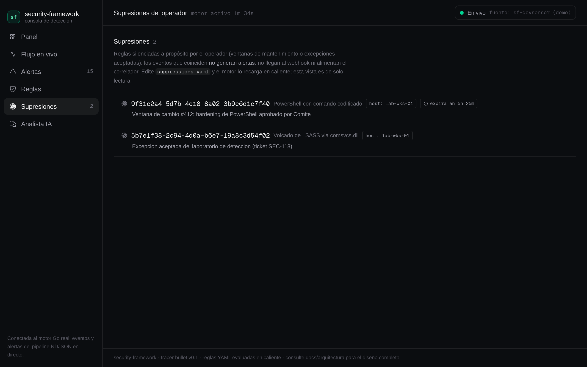

The active-response view (C3) is read-only by design: it renders the armed state of the kill surface (SIGKILL fixed, live operator allowlist count, audit file health against the 64 MiB ceiling) and the tail of the audit JSONL with executed AND denied attempts, newest first - every denial keeps its reason code (`operator_not_allowed`, `host_mismatch`, `self_protected`, `cooldown_active`, `idempotency_repeated`). The class filter, the operator-controlled queue window (100/500) and the client-side JSONL export of the whole fetched window (independent of the class filter - the export is a data artifact, the filter is a view lens) are the forensic operability layer; the kill itself is invoked through the API by a human operator, never from the console UI, and on an engine without `-allow-kill` the view shows a real "no disponible" (the surface does not exist, same as for any probe). One audit line per attempt is the contract: a successful kill - pidfd or degraded - never carries the mechanism in the JSONL (it travels in the API response and the engine log); the followup line that does carry `mechanism` (with the `fallback_reason` errno when the send degraded) is written only when a committed send fails:

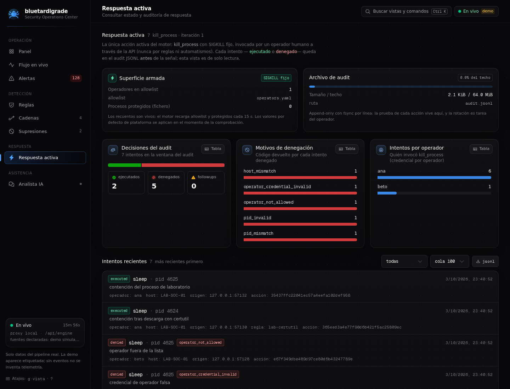

The degraded path itself is captured live: the second shot is the tail of a real fd-exhaustion live-fire - the lab filled the armed engine's file-descriptor table with idle TCP connections and delivered the kill over a connection accepted before the exhaustion, so `pidfd_open` failed with the real kernel `EMFILE` and the engine executed through the classic-kill fallback (target verified dead, `mechanism=fallback fallback_reason=emfile` in the API response and the engine log). The same tail shows the R2 fail-safe working under the same exhaustion: a name mismatch on a live decoy is denied by the pre-commit guard (`pid_mismatch`, resolved `real: sleep` versus the requested `notsleep`) without ever reaching the signal:

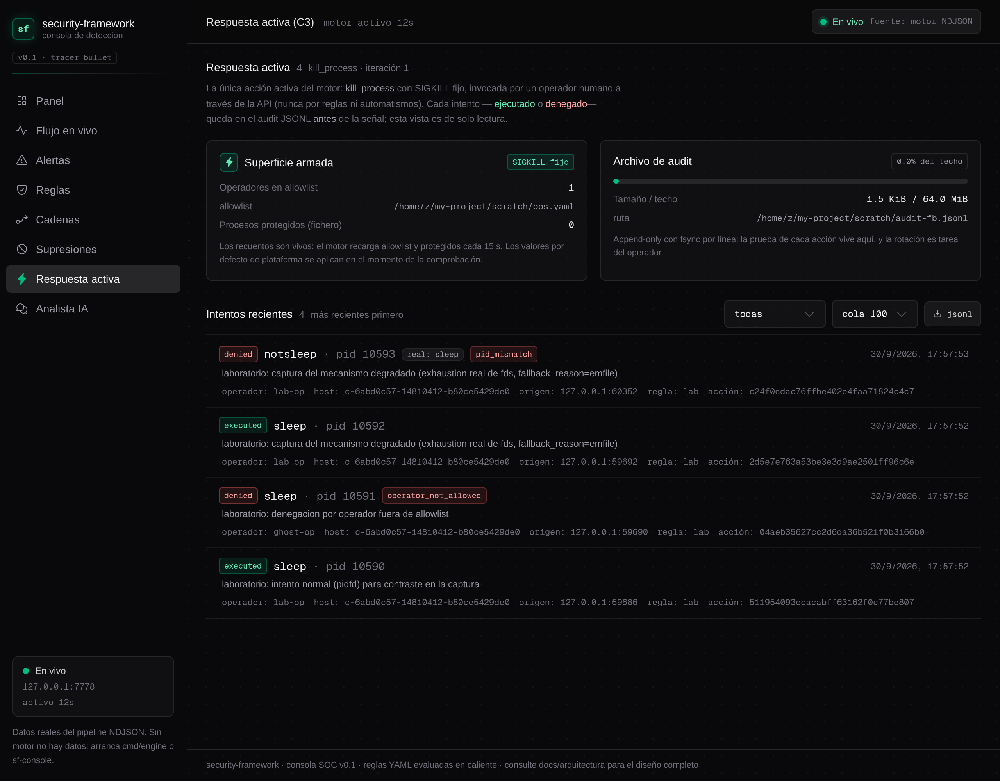

Requirements: [bun](https://bun.sh).

```bash
# terminal 1 — realtime hub (socket.io on :3003, engine bridge on :7778)
cd web/console-service && bun install && bun run dev

# terminal 2 — console (Next.js on :3000)
cd web/console && bun install && bun run dev

# optional terminal 3 — real engine to feed the console
make run-engine
```

Open http://localhost:3000. Point the UI at a remote hub with `NEXT_PUBLIC_CONSOLE_URL=http://hub-host:3003`. The console copy is in Spanish; see `web/console/README.md` for details.

## Building the real sensor (Windows)

Requirements: Rust stable with the `x86_64-pc-windows-msvc` target. Use **1.85 or newer**: the committed `Cargo.lock` resolves `time-core 0.1.9`, which needs the edition-2024 Cargo feature — older toolchains fail to parse that dependency's manifest even though this crate itself is edition 2021.

```bash
make build-sensor-windows
./sensor/target/x86_64-pc-windows-msvc/release/security-sensor.exe --addr 127.0.0.1:7777
```

The sensor has no simulated mode: it runs only where real telemetry exists (Windows ETW) and refuses to start anywhere else.

## Detection rules

Rules live in `rules/` as YAML, are validated at load, and hot-reload every 15 seconds by default (disable with `-reload-every 0`). The loader carries the same house caps as every other config surface: 4 MiB per file (checked before reading), a nesting-depth pre-scan and a 2048 enabled-rules ceiling — enforced fail-loud on startup and on every hot-reload tick, so an oversized or hostile file aborts startup, or keeps the previous set on reload, instead of degrading a running engine. The shipped pack uses 23 of those 2048 slots.

```yaml
- name: "PowerShell con comando codificado"
  id: "9f31c2a4-5d7b-4e18-8a02-3b9c6d1e7f40"
  severity: high
  event_type: process.create
  conditions:
    - field: process.name
      operator: eq
      value: "powershell.exe"
    - field: process.command_line
      operator: contains_any
      value: ["-enc", "-EncodedCommand", "-w hidden"]
  tags: ["attack.t1059.001", "attack.execution"]
  enabled: true
```

Operators (17): case-sensitive `eq`, `neq`, `contains`, `contains_any`, `startswith`, `endswith`, `regex`, `in`, `not_in`, `gt`, `lt`, plus the case-insensitive `i*` family — `ieq`, `icontains`, `icontains_any`, `istartswith`, `iendswith`, `iin` — which shares one Unicode folding semantics across all six operators and the `(?i)` regex fallback (the same property the Sigma mapping table below relies on).

The full shipped pack lives in `rules/` (YAML, several files): 23 rules
over 6 event types, severities 6 critical / 15 high / 2 medium. Every
rule documents its source TTP and the lab evidence that validates it.
This table is generated from the YAML files themselves, so it matches
what the engine loads:

| ID | Rule | Severity | Event type | ATT&CK | Tactic |
|----|------|----------|------------|--------|--------|
| `d37e8fa6` | Acceso a memoria de LSASS | critical | `process.access` | T1003.001 | credential-access |
| `b8d5f6e2` | Borrado de instantaneas VSS | critical | `process.create` | T1490 | impact |
| `a7c4e5f1` | Manipulacion de Windows Defender | critical | `process.create` | T1562.001 | defense-evasion |
| `4f7b0d26` | Volcado de LSASS con procdump | critical | `process.create` | T1003.001 | credential-access |
| `5b7e1f38` | Volcado de LSASS via comsvcs.dll | critical | `process.create` | T1003.001 | credential-access |
| `3e6a9c15` | Volcado del registro SAM | critical | `process.create` | T1003.002 | credential-access |
| `8dbf416a` | Borrado de registros de eventos | high | `process.create` | T1070.001 | defense-evasion |
| `e8a1c72d` | Creacion de tarea programada | high | `process.create` | T1053.005 | persistence |
| `8e2f3a51` | Defensa antivirus desactivada via registro | high | `registry.set` | T1562.001 | defense-evasion |
| `c1d24e9b` | Descarga con certutil o bitsadmin | high | `process.create` | T1105 | command-and-control |
| `9f31c2a4` | Ejecucion de PowerShell codificado | high | `process.create` | T1059.001 | execution |
| `d4e5f6a7` | Ejecucion desde directorio temporal | high | `process.create` | T1059 | execution |
| `f3b2d98e` | Ejecucion de procesos via WMI | high | `process.create` | T1047 | execution |
| `b1c2d3e4` | Ejecucion de script VBS/VBScript | high | `process.create` | T1059.005 | execution |
| `a1b2c3d4` | Servicios de Windows deshabilitados | high | `process.create` | T1562.001 | defense-evasion |
| `e5f6a7b8` | Uso de rundll32 para ejecucion | high | `process.create` | T1218.011 | defense-evasion |
| `f7a8b9c0` | Windows Defender exclusiones via linea de comandos | high | `process.create` | T1562.001 | defense-evasion |
| `d5e6f7a8` | Cambio de politica de ejecucion de PowerShell | medium | `registry.set` | T1112 | defense-evasion |
| `e9f0a1b2` | Consulta DNS a dominio generado (posible DGA) | medium | `network.connect` | T1568.002 | command-and-control |
| `f0a1b2c3` | Escritura de script en ruta de arranque | high | `file.write` | T1547.001 | persistence |
| `a9b8c7d6` | Nueva tarea remota via at o schtasks | high | `process.create` | T1053.002 | execution |
| `b7c8d9e0` | Persistencia en clave Run via registro | high | `registry.set` | T1547.001 | persistence |
| `c8d9e0f1` | Escritura de driver sin firmar | high | `image.load` | T1553.002 | defense-evasion |

Nota: los nombres de reglas y secuencias se mantienen en espanol, tal
como viven en los YAML del repositorio; no se traducen en la doc.


### Kill-chain correlation

Beyond per-event rules, the engine ships a sequence correlator: `sequences/*.yaml` lists named steps (exact rule names) that, when all observed on the same host inside a `window` (e.g. `5m`), raise a single high-signal alert describing the campaign. The shipped pack models credential-dump campaigns, full intrusion chains, defensive shutdown and registry-based persistence. Sequences hot-reload together with the rules. Load-time caps keep the config surface bounded (4 MiB/file, nesting depth 512, 512 sequences, 64 steps/chain, window ≤ 7 days, id/name/tag length caps, no control runes in strings that reach logs or alerts): an oversized or hostile file fails the load loudly instead of degrading a running engine. Steps naming rules that do not exist are reported as a WARNING at startup and on every reload, because a chain waiting on a ghost rule can never complete. Note: suppressing a rule also removes it from every chain it feeds on that host (accepted-state semantics — see [docs/false-positive-control.md](docs/false-positive-control.md)).

The shipped pack (`sequences/kill-chains.yaml`) defines 4 sequences, all
`critical`, window `5m`:

| ID | Sequence | Severity | Window | Steps (rules, unordered) |
|----|----------|----------|--------|--------------------------|
| `c0a5e7d1-1a2b-4c3d-8e4f-a5b6c7d8e9f0` | Campana de robo de credenciales | critical | 5m | Volcado de LSASS via comsvcs.dll + Volcado de LSASS con procdump + Volcado del registro SAM |
| `d1b6f8e2-2b3c-4d4e-9f50-b6c7d8e9f0a1` | Campana de intrusion completa | critical | 5m | Descarga con certutil o bitsadmin + Creacion de tarea programada + Borrado de instantaneas VSS |
| `e2c7a9f3-3c4d-4e5f-a061-c7d8e9f0a1b2` | Apagon defensivo | critical | 5m | Manipulacion de Windows Defender + Desactivacion del firewall de Windows + Borrado de registros de eventos |
| `f3d8ba64-4d5e-4f60-b172-d8e9f0a1b2c3` | Instalacion de persistencia | critical | 5m | Descarga con certutil o bitsadmin + Persistencia en clave Run via registro |

The correlator is observable from the outside: `/api/sequences` lists the armed chains (steps, window, tags) as loaded right now, and `/api/stats` carries `correlator_states` (chains in flight, one per sequence/host pair), `correlator_sequences` (loaded sequences) and `correlator_cap` (hard tracking cap, 8192). A hostile feed inventing hostnames drives `correlator_states` toward the cap — past it, NEW hosts silently stop being tracked, so a value climbing on a small fleet is a feed problem, not popularity. The console surfaces both: the `correlador N/cap` chip in the header turns red the moment the cap is reached, and the Cadenas view renders each chain as its step sequence and flags any step whose rule is not loaded (a chain that can never complete).

### Rule actions

Rules can declare an `actions` list; the engine executes it every time the rule fires (message rendering happens before the alert is written, so the console and the JSON log line carry the rendered text):

```yaml
  actions:
    # human message attached to the alert payload (`message` field);
    # placeholders: {host} {user} {rule} {severity} {event_type} {summary}
    # notify marks the alert for external notification (`notify` field)
    - type: alert
      config:
        message: "Robo de credenciales en {host} por {user}"
        notify: "true"

    # real HTTP POST of the full alert JSON (background delivery,
    # bounded in-flight queue, never blocks detection)
    - type: webhook
      config:
        url: "https://siem.example.com/hooks/edr"
        secret: "bearer-token-optional"   # sent as Authorization: Bearer
        timeout: 5s                        # per delivery, max 30s
```

Delivery failures are logged on stderr and never surface as detection errors; a dead webhook endpoint degrades to log noise, not data loss in the engine.

### Converting Sigma rules

`engine sigma` converts [Sigma](https://sigma.is) YAML rules into the native format above, so the community corpus can feed `rules/` without hand-transcription. The converter is **deterministic** (same corpus → byte-identical output) and **fail-loud**: a rule using a construct the engine cannot express faithfully is skipped with an explicit reason in the report, never translated approximately — a broken YAML file aborts the run instead of silently converting the rest.

```bash
engine sigma -dir ./corpus-sigma -out rules/converted.yaml
engine sigma -dir ./corpus-sigma -strict   # exit 1 if anything is skipped
```

What converts (v1 scope):

| Sigma | Native |
|-------|--------|
| `level` | `severity` (`informational` → `info`; missing level → skipped) |
| logsource category | `event_type`: `process_creation`→`process.create`, `file_event`→`file.write`, `network_connection`→`network.connect`, `registry_*`→`registry.set`, `image_loaded`/`driver_load`→`image.load`, `process_access`→`process.access` (Windows product only) |
| field names | the normalized schema (`Image`→`process.image`, `CommandLine`→`process.command_line`, `TargetObject`→`registry.key`, `DestinationIp`→`network.destination_ip`, …) — a field with no real equivalent skips the rule, naming it |
| wildcards | `*x*`→`contains`, `x*`→`startswith`, `*x`→`endswith`, exact→`eq`, anything else→anchored `regex` (literals escaped, `?`→`.`); values with letters use the case-insensitive `i*` family instead (`icontains`, `ieq`, …) and the regex fallback carries `(?i)` — Sigma string matching is case-insensitive by corpus convention, and all three paths share one Unicode folding semantics |
| value lists | `in` / `contains_any`, or a single alternation regex that keeps per-element anchoring |
| `condition` | `A`, `A and B…`, `A or B…`, `1 of them`, `all of them`, `1 of prefix*` — same-field ORs merge into one rule (`contains_any`/`in`), different-field ORs split into one rule per branch; `not`, parentheses and mixed `and/or` are skipped |
| modifiers | `contains`, `startswith`, `endswith`, `re`, `gt`, `lt` — encoding modifiers (`base64*`, `utf16*`, `wide`), `all` and `exists` are skipped |

Provenance travels in the converted rule: author, status, date, references and declared false positives are folded into the description (`[Sigma] …` line), the Sigma UUID stays as the rule `id`, and a `sigma` tag is prepended so imported rules are identifiable in `engine rules`, the console and the API. Bounds apply to the whole run (4 MiB per file, 512 emitted rules, per-rule caps on selections/fields/condition length). The E2E (`scripts/dev-tests/e2e_sigma.sh`) converts a committed fixture corpus and proves the converted rules fire on real telemetry through the engine's TCP feed.

## Engine CLI reference

The engine binary is `engine` (`make build` puts it in `bin/`; the
Windows installer installs it as `sf-engine`). Subcommands:

| Command | What it does |
|---------|--------------|
| `engine run [flags]` | start the full pipeline: ingest, enrichment, rules, correlator, suppressions, API, webhook |
| `engine rules [-rules dir]` | print the loaded rule pack as a table and exit |
| `engine validate [-rules dir] [-sequences dir]` | validate rules and sequences, print a report; exit code 0 when everything loads, non-zero on error (CI-friendly) |
| `engine sigma -dir dir-or-file [-out file] [-strict]` | convert a Sigma corpus to the native rule format; report lists every skipped rule with its reason; exit 0 only with at least one conversion (and, under `-strict`, zero skips) |
| `engine version` | print the engine version and exit |

### `engine run` flags

Every runtime flag below works identically on the classic single-dash
path (no subcommand) and on `engine run`.

| Flag | Default | Meaning |
|------|---------|---------|
| `-addr host:port` | `127.0.0.1:7777` | NDJSON ingest listen address (`0.0.0.0:7777` to accept remote sensors) |
| `-api host:port` | `127.0.0.1:7778` | read-only HTTP API; `0` disables it |
| `-rules dir` | `./rules` | rules directory (falls back to the directory next to the executable) |
| `-sequences dir` | `./sequences` | kill-chain sequences directory for the correlator |
| `-beacons file` | `./beacons.yaml` | beacon detector profiles (C2 call-home over `network.connect`; empty disables) |
| `-thresholds file` | `./thresholds.yaml` | volumetric threshold definitions (A2: alert when N predicate-matching events accumulate in one window, optionally grouped by a field); a definition without `group_by` aggregates every matching event under one internal key — the alert's host is whichever event crossed the threshold; missing file disables, malformed file is fatal, hot-reloaded |
| `-v` | off | print every event received |
| `-reload-every dur` | `15s` | hot-reload interval for rules, sequences and suppressions; `0` disables |
| `-webhook url` | empty | POST every alert as JSON to this URL (SIEM/SOAR connector) |
| `-webhook-token t` | empty | Bearer token on every webhook delivery (falls back to `SF_WEBHOOK_TOKEN`) |
| `-elastic url` | empty | Elasticsearch base URL; alerts bulk-indexed into `<index>-YYYY.MM.DD` with the alert ID as deterministic `_id` — see [SIEM sinks](#siem-sinks-elasticsearch--splink) |
| `-elastic-index prefix` | `sf-alerts` | index name prefix used with `-elastic` |
| `-elastic-api-key k` | empty | Elasticsearch API key sent as `Authorization: ApiKey` (falls back to `SF_ELASTIC_API_KEY`); empty disables the header |
| `-splunk url` | empty | Splunk HEC collector base URL; alerts POSTed to `/services/collector/event` — see [SIEM sinks](#siem-sinks-elasticsearch--splink) |
| `-splunk-token t` | empty | Splunk HEC token sent as `Authorization: Splunk` (falls back to `SF_SPLUNK_TOKEN`); empty disables the header |
| `-api-token t` | empty | bearer token the local API requires on `/api/*` and `/metrics` (falls back to `SF_API_TOKEN`); `/api/health` stays open |
| `-api-write` | off | arm `POST`/`DELETE /api/suppressions` (falls back to `SF_API_WRITE=1`); writes go to the `-suppressions` file, which stays the source of truth; refused at startup when the API has no token beyond loopback |
| `-allow-kill` | off | arm `POST /api/respond/kill` (falls back to `SF_ALLOW_KILL=1`): active response, kill_process, SIGKILL fixed; REQUIRES `-api-token`/`SF_API_TOKEN` even on loopback and an openable `-respond-audit` (otherwise the surface stays disabled, loud); the name check protects against killing the wrong PID, not against malware disguising its identity |
| `-respond-operators file` | `./respond-operators.yaml` | YAML allowlist (`{version: 1, names: [ana, beto]}`) of operators allowed to run active response; missing file = empty allowlist = every action denied; malformed file is fatal; hot-reloaded on the `-reload-every` ticker |
| `-respond-protected file` | empty | optional YAML (`{version: 1, names: [...]}`) with extra protected process names, merged with the platform defaults (Windows: csrss/smss/wininit/services/lsass); malformed file is fatal; hot-reloaded |
| `-respond-audit file` | `./respond-audit.jsonl` | append-only JSONL audit file, one line per attempt (denials included), fsync per line, 64 MiB ceiling: beyond it every action denies with `audit_unavailable` until the file is rotated |
| `-token t` | empty | shared ingest token (falls back to `SF_INGEST_TOKEN`); empty disables auth |
| `-token-previous t` | empty | previous ingest token, still accepted during a rotation window (falls back to `SF_INGEST_TOKEN_PREVIOUS`) |
| `-suppressions file` | `./suppressions.yaml` | operator allowlist YAML silencing rule/host pairs (expirations supported); empty disables |
| `-store path` | empty | SQLite file persisting events and alerts beyond the in-memory rings (e.g. `./sf-store.db`); empty disables — see [Persistent storage](#persistent-storage-sqlite-opt-in) |
| `-store-retention dur` | `72h` | delete stored events/alerts older than this on a 5-minute ticker; `0` keeps everything |
| `-pidfile path` | empty | write the process PID at startup and remove it on shutdown (lets `sf-console -Stop` stop an engine it did not start) |
| `-i`, `--interactive` | off | interactive TUI: live stats and alert feed in the terminal (degrades to the classic flat run when stdout is not a TTY) |

### Backward compatibility

Invoking the binary without a subcommand keeps the historical behavior:
the single-dash flags above apply directly, exactly as in `engine run`:

```bash
bin/engine -addr :7777 -v    # same as: bin/engine run -addr :7777 -v
bin/engine run -i            # interactive TUI
```

## Development & CI

Every push and pull request runs the same checks the maintainers run locally (`.github/workflows/ci.yml`, three jobs):

- **Go engine** — `gofmt` (no diffs), `go build`, `go vet`, `go test -count=1 ./...`, plus the OpenAPI drift guard (`scripts/dev-tests/check_openapi.py`, spec vs. `internal/api/api.go`) and the guard's self-test (`--self-test`: one positive plus thirteen negative fixtures that must produce findings).
- **Console** — hub: `bun install --frozen-lockfile`, `bun test`, `tsc --noEmit`; web console: same install, `tsc --noEmit`, `next build`.
- **Sensor** — `cargo check --locked` on two targets: the host and a Windows cross-check (`--target x86_64-pc-windows-msvc`, type/borrow check without linking — the ETW collector is Windows-first and this is the only way to verify it still compiles without a Windows host). The crate itself compiles on any OS; ETW ingestion is cfg-gated to Windows and refuses to run off-Windows.

Nightly (`.github/workflows/bench-nightly.yml`, also triggerable by hand), the pipeline bench runs the **real** engine over loopback with the documented baseline parameters (`cmd/bench -n 2000 -rate 1000`) in two passes on the same clock: a **rings** baseline, and a second identical pass with `-store` attached to a fresh SQLite file so the persistence overhead is measured, not assumed. The run summary records p50/p99 for both passes plus the store-overhead delta as data, alongside the runner identity and an fsync 4k dsync probe of the same medium the sqlite pass wrote to — the environment class that dominates the persistence tail, recorded per run because it is a datum of that run, not a property of the machine (the same role measured a 15.8 ms stalls-class tail one round and a 1.8 ms fast-fsync tail the next). The contract is enforced identically in each pass, and it is **advisory by design** (Director decision 6.2): a p99 at or above the phase-1 contract (< 10 ms) raises a warning annotation for the next review, but never fails the job — only a pipeline completeness failure (lost alerts, in either pass) turns the run red, because that is a functional defect, not a performance one. The same script runs locally: `bash scripts/dev-tests/bench_nightly.sh` (ports 7777/7778 free).

To run the equivalent suite locally (Go 1.22+, bun, cargo via rustup, python3 with PyYAML):

```bash
make ci
```

There are no mocked tests in the product path: the same rule of honesty the runtime follows applies to CI — what it verifies is what runs.

## How it compares

security-framework is a small, readable detection stack for Windows
telemetry, built for lab and educational use: one Go binary, YAML rules
you can read in an afternoon, and a kill-chain correlator you can audit
line by line. It is not a production SIEM or a managed EDR and does not
try to be. Where it sits next to tools you may already run:

| Project | What it is | How security-framework differs |
|---------|-----------|-------------------------------|
| Wazuh | full SIEM platform: manager, agents, compliance packs, dashboards, fleet management | Wazuh is a production deployment with real operational weight; this is a single binary plus a rule folder - useful to understand and extend a detection pipeline end to end, not to run a SOC |
| Velociraptor | DFIR tool for remote hunting and forensics at fleet scale | Velociraptor collects and hunts with its own query language, mostly on demand; this streams a narrow event schema into always-on rules and sequence correlation |
| Falco | runtime threat detection for Linux and containers (syscall events) | Falco covers Linux/syscall telemetry; this covers Windows ETW/Sysmon with process, registry, file and handle context, plus its own kill-chain correlator |
| osquery | fleet-wide SQL queries over host state | osquery answers point-in-time questions over a fleet; this is continuous detection over an event stream |
| Sigma | vendor-neutral rule format shared across SIEMs | Sigma is a specification, not a product; this ships its own small YAML format (also mapped to ATT&CK) tied to its evaluator - a deliberate trade: no format ecosystem, but rules, sequences and engine live in the same repo and hot-reload together |

If you need retention, analyst dashboards, agent fleet management or
compliance reporting, run a SIEM and ship the alerts there: the engine
webhook (`-webhook`) and the export endpoints (`/api/alerts/export`,
`/api/events/export`) exist precisely to feed a bigger pipeline.

## Repository layout

```
cmd/engine/       detection engine binary (Go)
cmd/devsensor/    demo sensor for development (Go): scripted scenario,
                  simulated data - the only simulated piece in the repo
cmd/bench/        load and latency harness (measures ingest→alert p50/p99)
internal/ingest/  NDJSON TCP listener + schema validation
internal/enrich/  enrichment pipeline (context, not evidence mutation)
internal/rules/   YAML parser, rule index and evaluator
internal/beacon/  C2 beaconing detector (timing analysis over network.connect)
internal/threshold/ volumetric detector (windowed per-rule/per-host counts)
internal/correlate/  kill-chain sequence correlator
internal/sigma/   Sigma rule converter (YAML -> native rule pack via engine CLI)
internal/alert/   alert rendering, dedup, structured JSON
internal/actions/ rule action executor (message templates, webhooks)
internal/redact/  URL credential redaction shared by outbound delivery paths (webhook/notify error reporting)
internal/api/     local HTTP API (read + alert triage write) + SSE stream + JSONL/CSV export
internal/risk/    per-host decayed risk score from recent alerts (served via /api/stats)
internal/store/   optional SQLite persistence (events/alerts history,
                  retention pruner; pure-Go driver, WAL)
internal/suppress/  operator allowlist: rule/host suppressions with expiry
internal/lifecycle/ alert triage state (acknowledged/closed + notes, JSON-persisted)
internal/webhook/ alert webhook delivery (bounded queue, retries)
internal/notify/  external notifications (Slack/Telegram/email channels, bounded queues)
internal/siem/    native SIEM sinks (Elasticsearch Bulk API + Splunk HEC, bounded spools)
internal/respond/  active response (C3): operator-gated kill_process, append-only JSONL audit
pkg/model/        unified event schema (the wire contract)
sensor/           Rust ETW sensor (collector is Windows-gated)
rules/            seeded detection pack (windows/)
sequences/        kill-chain sequences for the correlator
suppressions.example.yaml  annotated allowlist format (rename to
                  suppressions.yaml to arm it)
beacons.yaml      C2 beaconing detector config (hot-reloaded with the rules)
thresholds.yaml   volumetric detector config (hot-reloaded with the rules)
scripts/windows/  installed runtime scripts (sf-sensor, sf-console, ...)
                  + bundled sysmon-config.xml tuned to the detection pack
scripts/dev-tests/ end-to-end verification scripts (per-detector and lifecycle E2E,
                  OpenAPI drift check, two-pass nightly bench, webhook and SIEM
                  receivers, ingest-auth and SQLite store smokes, all with real binaries)
scripts/arq_v04/  versioned pipeline that renders the architecture PDF (generator,
                  cover/diagram renderers, merge+metadata, build.sh - every
                  revision of docs/arquitectura-tecnica-v*.pdf is a reproducible
                  command, not a hand edit)
install.ps1       one-command Windows installer
uninstall.ps1     standalone uninstaller
Makefile          build automation (engine, sensor, console, docker)
Dockerfile        production container for the engine
docs/             architecture document, OpenAPI spec (docs/api/),
                  diagram assets and agent round reports (docs/agentes/)
web/console/          Next.js console (live feed, triage, AI analyst)
web/console-service/  realtime telemetry hub (bun + socket.io)
website/          official landing page (Next.js 16 + Tailwind 4 + shadcn/ui)
```

## Measured performance

The phase-1 promise (p99 < 10 ms) is now measured, not assumed. `cmd/bench` is a load and latency harness: it streams process.create events that deterministically fire one seeded rule, listens on the engine SSE stream and measures every alert on the same clock — from the NDJSON line leaving the client to the alert frame arriving, i.e. the full pipeline (ingest parse, rule evaluation, alert build, broadcast) plus the SSE hop the console experiences.

Measured with `go run ./cmd/bench -n 2000 -rate 1000` against a live engine (loopback, Linux development VM, 23 rules loaded), three consecutive runs, 2000/2000 alerts produced and sampled each time:

```
latency p50 : 133-139 µs      latency p90 : 187-211 µs
latency p99 : 319-434 µs      latency max : 0.73-5.9 ms
throughput  : ~830 ev/s sustained at that rate cap
```

Two honest caveats the harness documents by design: the numbers are loopback on a development host — a Windows endpoint under real Sysmon load will see higher ingest-side latency, and the bench measures the engine, not the sensor; and the SSE fan-out is best-effort (slow subscribers miss frames instead of stalling the engine), so a burst at unlimited speed (~128k ev/s) shows the alerts still produced 2000/2000 while the bench client's frames arrive late — backpressure, not loss.

The nightly's second pass quantifies what the opt-in SQLite store costs on that same clock: in its most recent run, p99 moved from 365 µs (rings) to 870 µs with `-store` attached — a +505 µs (+138%) overhead recorded as data, not a verdict, with both passes still far inside the phase-1 contract. That is the price of the durable history described in [Persistent storage](#persistent-storage-sqlite-opt-in); the caveat above about real endpoints applies to both passes equally.

Run it yourself against a live engine (re-runs are safe: the bench
uses a per-run host, so the engine's 60 s alert dedup never swallows
a second run; engines started with `-api-token` need the same
credential passed to the bench):

```bash
go build -o bin/bench ./cmd/bench
bin/bench -addr 127.0.0.1:7777 -api 127.0.0.1:7778 -n 2000 -rate 1000
bin/bench -addr 127.0.0.1:7777 -api 127.0.0.1:7778 -api-token <token> -n 2000
```

## Documentation map

| Document | Contents |
|----------|----------|
| [`docs/arquitectura-tecnica-v0.9.pdf`](docs/arquitectura-tecnica-v0.9.pdf) | full technical architecture (Spanish; current revision, generated by the versioned pipeline `scripts/arq_v04/` — includes C2 notifications, native SIEM sinks and audited C3 active response with its read surface, forensic console operability (class filter, 100/500 window, JSONL export), dual kill mechanism certified permanently in CI, real lab captures of the respond view embedded (Figures 3-4) and the two-suite console battery floors (19 tests / 58 assertions); v0.1/v0.2/v0.3/v0.4/v0.5/v0.6/v0.7/v0.8 kept for provenance) |
| [`docs/api/openapi.yaml`](docs/api/openapi.yaml) | OpenAPI 3.0 contract of the API surface, drift-guarded in CI against `internal/api/api.go` |
| [`docs/false-positive-control.md`](docs/false-positive-control.md) | the operator guide to alert noise: suppression recipes, dedup semantics, correlator volume, receiver-side filtering, abuse-resistance caps |
| [`docs/analisis-brechas-y-mejoras.md`](docs/analisis-brechas-y-mejoras.md) | gap analysis and future improvements (Spanish; verified snapshot of what exists, what is missing across sensor/deployment/detection-content/ecosystem, with prioritized proposals and provenance) |
| [`docs/agentes/`](docs/agentes) | round-by-round development reports (multi-agent workflow, verifications included) |
| `rules/`, `sequences/`, `suppressions.example.yaml` | the shipped detection content, annotated and lab-validated |

## Roadmap

| Phase | Window          | Delivers                                              |
|-------|-----------------|-------------------------------------------------------|
| 1     | weeks 1–6 2026  | tracer bullet, ETW sensor, rule index, p99 < 10 ms    |
| 2     | weeks 7–14 2026 | YARA memory scan, eBPF collector; SQLite persistence already shipped (`-store`, Sept 2026) |
| 3     | weeks 15–20     | ecosystem hooks shipped ahead of window: REST+OpenAPI spec (drift-guarded in CI), alert webhook, Slack/Telegram/email notifications, native Elastic/Splunk SIEM sinks |
| 4     | weeks 21–26     | Python filaments (sandboxed), plugins, benchmarks     |

## Contributing

Issues and PRs are welcome. Every detection PR must include: the TTP it models, the lab evidence (events produced) and the false-positive profile observed on a clean host.

## License

Apache License 2.0. See [LICENSE](LICENSE).
