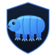
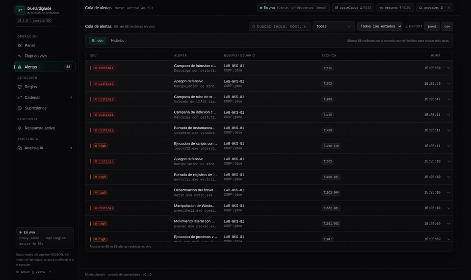
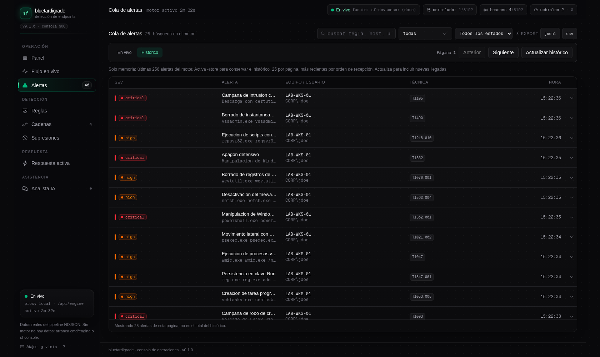
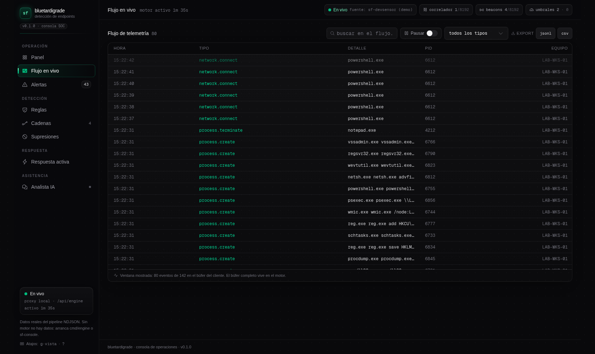
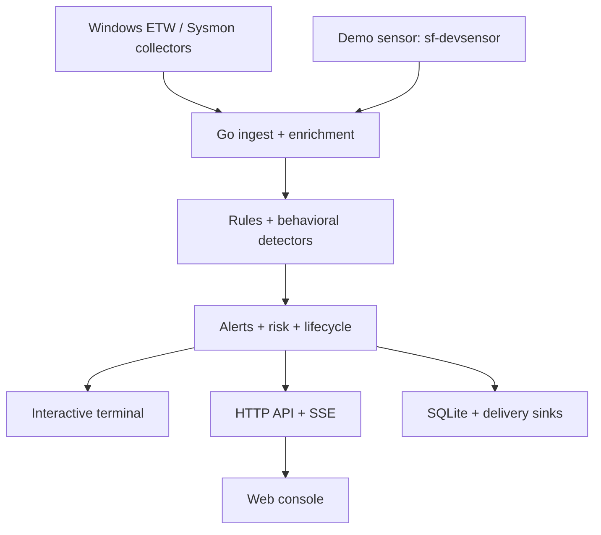

<div align="center">



# bluetardigrade

**Real-time threat detection for Windows endpoints.**

Named after the most resilient animal on Earth: one static Go binary,
zero runtime dependencies, fail-loud degradation instead of silent rot.

[](https://github.com/Ruby570bocadito/bluetardigrade/actions/workflows/ci.yml)
[](LICENSE)
[](go.mod)
[](sensor/)
[](CHANGELOG.md)
[](#contributing)

[Quickstart](#quickstart) · [Web console](#web-console) · [Detection](#detection-and-integrations) · [Architecture](#architecture) · [Roadmap](#roadmap) · **[Guía en español](docs/GUIA-INICIO.md)**

</div>

---

A Rust ETW sensor streams process telemetry from Windows hosts into a single
Go binary: YAML rules mapped to MITRE ATT&CK, kill-chain correlation, C2
beaconing detection, volumetric thresholds and decaying per-host risk —
delivered to an interactive CLI, a REST+SSE API, a live SOC console, and
optional SQLite history with SIEM/webhook fan-out.

**Pre-1.0, intended for labs and research.** The engine, demo and console run
independently of Windows. Real Windows collection uses the Rust ETW sensor or
the Sysmon path; the separate `sf-devsensor` replays a clearly-labeled demo
scenario. Zero simulated data in the product path.

## Quickstart

### Windows — one command

Open **PowerShell** and paste:

```powershell
irm https://raw.githubusercontent.com/Ruby570bocadito/bluetardigrade/main/install.ps1 | iex
```

That is the whole install: user-level (no admin), sha256-verified toolchain
downloads, shims on your `PATH` (`sf-engine`, `sf-sensor`, `sf-console`,
`sf-devsensor`, `sf-update`, `sf-uninstall`), with an optional autostart and
Sysmon setup. Then:

```powershell
sf-console      # engine + SOC console + browser opens at localhost:3000
sf-devsensor   # demo scenario: 18 labeled detections flow into the console
```

Want **real telemetry** from the host instead of the demo?

```powershell
sf-sensor -SetupSysmon   # one-time Sysmon install with the tuned config (UAC)
sf-sensor               # real host activity -> detections
```

With arguments (webhook delivery, ingest auth, autostart):

```powershell
& ([scriptblock]::Create((irm https://raw.githubusercontent.com/Ruby570bocadito/bluetardigrade/main/install.ps1))) -WithSensor -AutoStart -IngestToken <token>
```

### Any OS with Go

```bash
git clone https://github.com/Ruby570bocadito/bluetardigrade.git
cd bluetardigrade
make build
./bin/engine run -i        # interactive terminal panel
./bin/devsensor -addr 127.0.0.1:7777   # second terminal: demo scenario
```

Or with Docker (tokens via `SF_API_TOKEN` / `SF_INGEST_TOKEN` env):

```bash
docker build -t bluetardigrade .
docker run --rm -p 7777:7777 -p 7778:7778 bluetardigrade
```

| Component | Default endpoint |
|-----------|------------------|
| Sensor ingest | `127.0.0.1:7777`, NDJSON over TCP (TLS + AUTH optional) |
| Engine API | `http://127.0.0.1:7778`, REST + SSE (TLS optional) |
| Web console | `http://localhost:3000` |
| Optional AI analyst hub | `http://127.0.0.1:3003` |

Real telemetry: [Windows installation](docs/OPERATIONS.md#one-command-install-windows) · [Sysmon setup](docs/OPERATIONS.md#real-telemetry-with-sysmon-recommended) · [Rust sensor build](docs/OPERATIONS.md#building-the-real-sensor-windows) · [Docker](docs/OPERATIONS.md#docker).

## Interactive CLI

`engine run -i` provides a bounded, keyboard-driven workspace with alert and rule views. Search by alert/event ID, event type, rule, host, user, summary or ATT&CK tag; filter severity; inspect a selected alert or a rule's conditions. Search is case-insensitive and every whitespace-separated term must appear somewhere in the row's fields: `LAB-A powershell` combines host and rule evidence. Historical selection stays steady when new alerts arrive, and the catalogue follows rule reloads.

| Key | Action |
|-----|--------|
| `1` / `2` / `Tab` | Alerts / rules |
| `↑` / `↓` or `j` / `k` | Select a row; scroll details |
| `PgUp` / `PgDown`, `Home` / `End` | Page, first or last row |
| `Enter` | Open / close details |
| `/` | Search; `Enter` applies, `Esc` clears |
| `s` | Cycle the severity filter |
| `p` / `Space` | Pause / resume the **view** |
| `Esc` | Return to the list; clear filters in the list |
| `?` / `h` | Help |
| `q` / `Ctrl+C` | Stop the engine |

The terminal retains the last **100 alerts**. Pausing leaves ingest, detection, the API and delivery running. Control characters in telemetry are neutralized for human display; JSON evidence remains unchanged. Webhook credentials are hidden in the banner.

```bash
./bin/engine rules                           # inspect the loaded pack
./bin/engine validate                        # configuration errors and warnings
./bin/engine sigma -dir corpus -out rules/imported.yaml
./bin/engine version
./bin/engine run -h                          # complete runtime flags
```

The classic `engine -addr ... -rules ...` invocation still works. Routed commands reject unexpected positional arguments instead of silently ignoring subsequent flags.
## Web console

With the engine running:

```bash
cd web/console
bun install --frozen-lockfile
bun run dev               # or: bun run build && bun run start
```

Everything the browser needs travels through the console's same-origin
engine proxy — the API token never reaches the client. The AI hub
(`web/console-service`) is optional and bring-your-own-model.



*Real captured session — the engine ingesting 411 events with detections
arriving over SSE. No mockups, no staged data.*

| View | Operator workflow |
|------|-------------------|
| Panel | Pending critical triage, KPIs, rolling activity, hot hosts |
| Flujo en vivo | Pause, search, event-type filters, JSONL/CSV export |
| Alertas | Live buffer or paged engine history; severity and lifecycle filters; evidence; ack / close / reopen |
| Reglas / Cadenas | Loaded conditions, ATT&CK mappings and kill-chain steps |
| Supresiones | Operator allowlist with reasons and expirations |
| Respuesta activa | Read-only response state and forensic audit |
| Analista IA | Optional triage assistance through your configured model |

<details>
<summary><b>Console captures</b> (live session)</summary>

Use **Ver críticas sin cerrar** or the new/acknowledged/closed counts in the
operation summary to open that triage queue directly. These shortcuts use
the same live window as the counts, clear old alert search/history/selection
filters and preserve other views' URL lenses. Browser Back restores the
previous investigation. The shortcuts are disabled while the API is unavailable.

Deep links such as `/?view=alertas&historial=1&estado=open&sev=critical&q=lsass` survive refresh and browser history. Navigation also supports `g` followed by `p/f/a/r/c/s/k/n`; a keyboard skip link goes straight to the main content.

| | |
|---|---|
|  |  |
| Operations panel with live KPIs | Alert triage queue with severity classes |
|  |  |
| Paged engine history with search | Rule browser with ATT&CK mapping |
|  |  |
| Kill-chain sequences | Live telemetry feed |

Open **Comandos** in the header or press **Ctrl+K / ⌘K** to search all eight
views, refresh engine data or open keyboard help. Search accepts accents,
multiple words and common operator terms. Use ↑/↓ to choose, Enter to run
and Escape to close. Navigation respects text fields, composite controls,
composition and other modals; closing a dialog restores focus.

In **Alertas**, switch to **Histórico** to search the engine rather than the browser's retained buffer. SQLite provides persisted history when `-store` is enabled; otherwise the view clearly identifies the 256-alert memory window. Pages contain 25 alerts ordered by reception. Cursor navigation pins the upper sequence, so new arrivals do not shift visited pages. Retention and triage decisions can still change membership. **Actualizar histórico** starts a fresh search. Detection evidence and lifecycle state are server filters; lifecycle notes remain searchable in the live view. A bounded scan can return an empty page with **Seguir buscando**, and an older engine reports the missing capability explicitly.
</details>

Deep links (`?view=alertas&historial=1&estado=open&sev=critical&q=lsass`)
survive refresh; keyboard-first navigation with `g` + view key; a keyboard
skip link and full `prefers-reduced-motion` support. Unavailable metrics show
**`—`**, never zero. [Console configuration and AI setup](web/console/README.md)
· [Environment template](web/console/.env.example).

## Detection and integrations

| Capability | Shipped surface |
|------------|-----------------|
| Detection content | 23 YAML rules, four kill chains, beaconing profiles and volumetric thresholds |
| Rule workflow | Hot reload, validation, 17 operators and Sigma import |
| Triage | Alert lifecycle, operator notes and host-scoped suppressions |
| Persistence | Optional pure-Go SQLite, WAL, retention pruner |
| Delivery | Webhooks, Elasticsearch, Splunk HEC, Slack, Telegram and email |
| API | REST + SSE + Prometheus, native TLS, OpenAPI contract drift-guarded in CI |
| Response | Opt-in, authenticated and audited `kill_process`; console visibility is read-only |



See [the operations guide](docs/OPERATIONS.md) for configuration, detection
tables, authentication, TLS and response requirements, and
[false-positive control](docs/false-positive-control.md) for noise tuning.

## Architecture

`pkg/model` defines the event contract. Four moving parts, zero black boxes:
the Rust sensor, the Go engine, the console and the outputs. Detailed data
flow and package responsibilities: [ARCHITECTURE.md](docs/ARCHITECTURE.md) ·
[Technical PDF (Spanish)](docs/arquitectura-tecnica-v0.11.pdf).

The console job also runs DOM regressions and Chromium checks of the built
application on desktop and mobile viewports. REST/SSE data in those browser
checks are isolated fixtures. `make console-browser` runs them locally after
building the console; screenshots are retained as CI artifacts.

### Measured performance

Historical loopback runs recorded ingest→alert p99 around **0.4 ms** with the
23-rule pack. This is a lab measurement, not a deployment guarantee. Run
`cmd/bench` or the nightly harness to measure your own environment.
[Method and results](docs/OPERATIONS.md#measured-performance).

## Repository layout

```text
cmd/engine/           Go engine and interactive CLI
cmd/devsensor/        labeled demo scenario
cmd/bench/            latency and load harness
internal/            detection, persistence, API and delivery packages
pkg/model/           event wire contract
sensor/              Rust Windows ETW collector
rules/  sequences/   YAML detection content
web/console/         Next.js operator console
web/console-service/ Bun + socket.io AI analyst hub
website/             project landing page
scripts/             Windows tooling and verification harnesses
docs/                operations, architecture and API reference
```

## Documentation

| Document | Use it for |
|----------|------------|
| [Guía de inicio](docs/GUIA-INICIO.md) | First run and troubleshooting in Spanish |
| [Operations](docs/OPERATIONS.md) | Installation, flags, API, storage, integrations and CLI |
| [Architecture](docs/ARCHITECTURE.md) | System design and event contract |
| [OpenAPI](docs/api/openapi.yaml) | API integration |
| [False-positive control](docs/false-positive-control.md) | Suppression and deduplication tuning |
| [Command palette and browser checks](docs/PALETA-Y-PRUEBAS-NAVEGADOR.md) | Commands, keyboard scope, native dialogs and reproducible Chromium regressions |
| [CLI search and dashboard triage](docs/INVESTIGACION-CLI-Y-TRIAJE.md) | Alert identity search, multiword queries and direct triage shortcuts |
| [Technical architecture PDF](docs/arquitectura-tecnica-v0.11.pdf) | Spanish technical reference |
| [Changelog](CHANGELOG.md) | Release history |
| [Security policy](SECURITY.md) | Private vulnerability reporting |

## Development

```bash
make test             # Go tests
make ci               # full CI-equivalent checks; prerequisites in Makefile

cd web/console
bun test && bun run typecheck && bun run build
```

CI covers Go formatting, build, vet, staticcheck and race tests; console and
hub tests/types; a production console build; the OpenAPI drift guard; Rust
checks on Linux and Windows; and a native Windows response smoke. Actions are
SHA-pinned, permissions minimal, releases gated on SemVer + CHANGELOG.

## Roadmap

- **Shipped:** rule and behavioral detection, triage, storage, integrations,
  terminal workspace, live console with command palette, native TLS on both
  listeners, forensic timeline capture.
- **Next interface work:** broaden browser coverage, saved hunts and moving
  lifecycle persistence into SQLite.
- **Sensor work:** extend native ETW providers beyond process creation;
  broaden Windows runtime coverage.
- **Research:** YARA memory scanning, sandboxed extensions, eBPF collector.

## Contributing

Open an issue or a focused PR with the problem, resulting behavior and
verification. Detection changes should include the modeled TTP, lab events
and the observed false-positive profile. Report vulnerabilities privately
using [SECURITY.md](SECURITY.md).

> The repository was renamed from `security-framework` to `bluetardigrade`;
> GitHub redirects the old URLs, and the Windows shims keep their `sf-*`
> names so existing installs keep working across `sf-update`.

## License

[Apache License 2.0](LICENSE).
