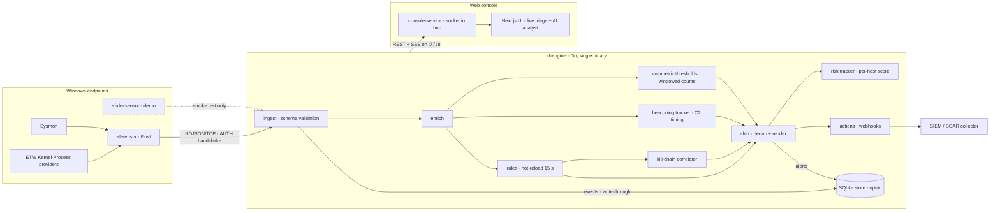

# Architecture

The project overview and quickstart live in the [README](README.md); the day-to-day operation manual in [OPERATIONS.md](OPERATIONS.md). This document holds the system architecture, the full annotated repository tree and the detailed feature inventory.

## System overview




The unified event schema (chapter 4 of the docs) is the master contract: sensors emit it, the engine validates and enriches it, rules index it, interfaces consume it.

Full write-up: [docs/arquitectura-tecnica-v0.9.pdf](arquitectura-tecnica-v0.9.pdf) (Spanish). The v0.9 revision reflects the implemented and verified state — authenticated ingest, all four detection packages (risk, thresholds, beaconing, Sigma import) with the rules-loader house caps and the unified `i*` folding semantics, the C2 external notifications and the native Elasticsearch/Splunk SIEM sinks, the audited C3 active response with its read surface (`GET /api/respond/state`, `GET /api/respond/audit`) rendered in the console — now with forensic operability: attempt-class filter (executed / denied / followups), an operator-controlled 100/500 tail window and a client-side JSONL export of the visible tail — plus its dual kill mechanism (pidfd with declared `fallback_reason` on Linux, handle on Windows) carrying the permanent CI behavioral certification, real lab captures of the respond view embedded as Figures 3 and 4 (12 genuine audit lines, complete F1 pair), the export API, the OpenAPI spec (15 routes / 36 stats fields / 74 resolved refs, guard self-test included), the alert webhook, the two-pass nightly bench (rings vs. SQLite store), the opt-in SQLite store and the Next.js console — with the console-battery floors updated to the two-suite state (19 tests / 58 assertions; the triage-write suite landed by the 20h50 coverage wave, cross-review certified) — and keeps an honest roadmap-status column with cited provenance; [`docs/README.md`](README.md) tracks what remains design-only (YARA, gRPC, filaments, eBPF). It is produced by the versioned in-tree pipeline (`scripts/arq_v04/`), so each revision is a reproducible command rather than a hand edit. The v0.1 design document and the v0.2/v0.3/v0.4/v0.5/v0.6/v0.7/v0.8 revisions are kept for provenance.

## Feature inventory

| Area | What you get today |
|------|--------------------|
| **Telemetry** | Rust ETW sensor (Kernel-Process) + Sysmon ingestion path; NDJSON/TCP feed with schema validation and enrichment (user, command line, network context) |
| **Detection** | YAML rules with 17 operators (`eq`, `regex`, `contains_any`, …), hot-reload every 15 s, per-rule MITRE ATT&CK tags and actions; `engine sigma` imports community Sigma rules (deterministic, fail-loud, provenance preserved) |
| **Correlation** | Kill-chain sequencer: named steps across the same host within a time window raise one high-signal campaign alert |
| **Risk scoring** | Severity-weighted per-host score with time decay (half-life 30 min, bounded host map): `hot_hosts` top-5 and `risk_hosts_tracked` in `/api/stats`, `sf_host_risk_score{host=...}` in `/metrics`, hot-hosts panel in the console dashboard |
| **Beaconing** | Behavioral C2 call-home detector over `network.connect` (package A3): coefficient-of-variation regularity per (profile, host, destination), `min_interval` false-positive floor, per-key cooldown, bounded state — conservative profiles ship in `beacons.yaml` and detections flow through the standard alert pipeline (suppressions, triage, store, webhook, console) |
| **Response** | Active response `kill_process` (C3, opt-in): armed only with `-allow-kill` + API token + open audit (otherwise a real `404`), five permission layers, append-only JSONL audit (fsync, 64 MiB ceiling) written before every signal, pidfd/handle process guard with declared `fallback_reason`; alert triage lifecycle (acknowledge / close / reopen with notes, persisted via `-lifecycle`), operator suppressions (rule/host, expiry, hot-reload), alert webhook with Bearer auth and bounded retries, external notifications to Slack / Telegram / email with per-channel severity floors (C2) |
| **API** | Local REST API with OpenAPI 3.0 spec (drift-guarded in CI), SSE live stream, filters, JSONL/CSV export with formula-injection neutralization |
| **Console** | Live feed, KPI dashboard, severity triage with free-text search, rule browser, kill-chain chains view, suppressions view, read-only active-response view with its forensic audit trail (attempt-class filter, operator-controlled tail window, JSONL export), AI analyst (bring-your-own OpenAI-compatible endpoint) |
| **Storage** | Opt-in SQLite persistence (`-store`): events and alerts outlive restarts, retention pruner, lists and exports read the full history |
| **Auth** | Shared-token ingest handshake (constant-time), zero-downtime token rotation window, optional Bearer on the API and on outbound webhooks |
| **Ops** | One-command Windows installer (six commands on PATH), Docker image for the engine, GitHub Actions CI on every push |

## Repository layout

```
cmd/engine/       detection engine binary (Go)
cmd/devsensor/    demo sensor for development (Go): scripted scenario,
                  simulated data - the only simulated piece in the repo
cmd/bench/        load and latency harness (measures ingest→alert p50/p99)
internal/ingest/  NDJSON TCP listener + schema validation
internal/enrich/  enrichment pipeline (context, not evidence mutation)
internal/rules/   YAML parser, rule index and evaluator
internal/beacon/  C2 beaconing detector (timing analysis over network.connect)
internal/threshold/ volumetric detector (windowed per-rule/per-host counts)
internal/correlate/  kill-chain sequence correlator
internal/sigma/   Sigma rule converter (YAML -> native rule pack via engine CLI)
internal/alert/   alert rendering, dedup, structured JSON
internal/actions/ rule action executor (message templates, webhooks)
internal/redact/  URL credential redaction shared by outbound delivery paths (webhook/notify error reporting)
internal/api/     local HTTP API (read + alert triage write) + SSE stream + JSONL/CSV export
internal/risk/    per-host decayed risk score from recent alerts (served via /api/stats)
internal/store/   optional SQLite persistence (events/alerts history,
                  retention pruner; pure-Go driver, WAL)
internal/suppress/  operator allowlist: rule/host suppressions with expiry
internal/lifecycle/ alert triage state (acknowledged/closed + notes, JSON-persisted)
internal/webhook/ alert webhook delivery (bounded queue, retries)
internal/notify/  external notifications (Slack/Telegram/email channels, bounded queues)
internal/siem/    native SIEM sinks (Elasticsearch Bulk API + Splunk HEC, bounded spools)
internal/respond/  active response (C3): operator-gated kill_process, append-only JSONL audit
pkg/model/        unified event schema (the wire contract)
sensor/           Rust ETW sensor (collector is Windows-gated)
rules/            seeded detection pack (windows/)
sequences/        kill-chain sequences for the correlator
suppressions.example.yaml  annotated allowlist format (rename to
                  suppressions.yaml to arm it)
beacons.yaml      C2 beaconing detector config (hot-reloaded with the rules)
thresholds.yaml   volumetric detector config (hot-reloaded with the rules)
scripts/windows/  installed runtime scripts (sf-sensor, sf-console, ...)
                  + bundled sysmon-config.xml tuned to the detection pack
scripts/dev-tests/ end-to-end verification scripts (per-detector and lifecycle E2E,
                  OpenAPI drift check, two-pass nightly bench, webhook and SIEM
                  receivers, ingest-auth and SQLite store smokes, all with real binaries)
scripts/arq_v04/  versioned pipeline that renders the architecture PDF (generator,
                  cover/diagram renderers, merge+metadata, build.sh - every
                  revision of docs/arquitectura-tecnica-v*.pdf is a reproducible
                  command, not a hand edit)
install.ps1       one-command Windows installer
uninstall.ps1     standalone uninstaller
Makefile          build automation (engine, sensor, console, docker)
Dockerfile        production container for the engine
docs/             architecture document, operations guide (OPERATIONS.md),
                  OpenAPI spec (docs/api/), diagram assets and agent round
                  reports (docs/agentes/)
web/console/          Next.js console (live feed, triage, AI analyst)
web/console-service/  realtime telemetry hub (bun + socket.io)
website/          official landing page (Next.js 16 + Tailwind 4 + shadcn/ui)
```
