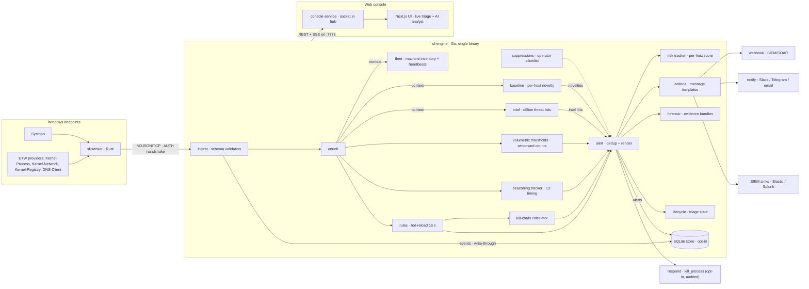

# Architecture

The project overview and quickstart live in the [README](README.md); the day-to-day operation manual in [OPERATIONS.md](OPERATIONS.md). This document holds the system architecture, the full annotated repository tree and the detailed feature inventory.

## System overview




The unified event schema (`pkg/model`) is the master contract: the
Rust ETW sensor, the Go SOC collector and any external producer all
emit it; the engine validates, enriches and indexes it; the local
API, the web console and the SIEM/notification sinks all consume the
alerts derived from it. Sensors and collectors never branch the
schema — a new telemetry source is a new producer of the same
events, not a new wire format.

File detections and evidence are described in
[DETECCION-Y-EVIDENCIA.md](DETECCION-Y-EVIDENCIA.md); saved investigations,
CSV protection, analyst behavior and real/demo verification boundaries are in
[INVESTIGACIONES-GUARDADAS-Y-ANALISTA.md](INVESTIGACIONES-GUARDADAS-Y-ANALISTA.md).
The current feature inventory is below and pending work is in
[ROADMAP.md](ROADMAP.md). The old architecture PDF (v0.11) was retired: it
no longer matched the code; its earlier revisions live in GitHub Releases.

## Feature inventory

| Area | What you get today |
|------|--------------------|
| **Telemetry** | Rust ETW sensor (Kernel-Process for process create/start/end, Kernel-Network for TCP connects, Kernel-Registry for SetValueKey, DNS-Client for query answers) + Sysmon ingestion path; NDJSON/TCP feed with schema validation and enrichment (user, command line, network context, image hashes) |
| **SOC imports** | Explicit Go adapter for six observed log/mail formats; TLS/auth remote ingest, bounded attributes separated from engine enrichment |
| **Analyst reports** | CLI API lookup plus human notes and exclusive file output; browser-local report catalog, frozen snapshots and Markdown/JSON exports |
| **Detection** | 114 enabled YAML rules with 17 operators (`eq`, `regex`, `contains_any`, …), hot-reload every 15 s, per-rule MITRE ATT&CK tags and actions; `engine sigma` imports community Sigma rules (deterministic, fail-loud, provenance preserved) |
| **Forensics** | Bounded per-host flight recorder; atomic high/critical evidence bundles with a 5-minute window and preserved trigger, served through the bearer-gated API; lazy console timeline with full JSON/JSONL downloads |
| **Correlation** | Kill-chain sequencer: named steps across the same host within a time window raise one high-signal campaign alert |
| **Risk scoring** | Severity-weighted per-host score with time decay (half-life 30 min, bounded host map): `hot_hosts` top-5 and `risk_hosts_tracked` in `/api/stats`, `sf_host_risk_score{host=...}` in `/metrics`, hot-hosts panel in the console dashboard |
| **Beaconing** | Behavioral C2 call-home detector over `network.connect` (package A3): coefficient-of-variation regularity per (profile, host, destination), `min_interval` false-positive floor, per-key cooldown, bounded state — conservative profiles ship in `beacons.yaml` and detections flow through the standard alert pipeline (suppressions, triage, store, webhook, console) |
| **Response** | Active response `kill_process` (C3, opt-in): armed only with `-allow-kill` + API token + open audit (otherwise a real `404`), five permission layers, append-only JSONL audit (fsync, 64 MiB ceiling) written before every signal, pidfd/handle process guard with declared `fallback_reason`; alert triage lifecycle (acknowledge / close / reopen with notes, persisted via `-lifecycle`), operator suppressions (rule/host, expiry, hot-reload), alert webhook with Bearer auth and bounded retries, external notifications to Slack / Telegram / email with per-channel severity floors (C2) |
| **API** | Local REST API with OpenAPI 3.0 spec (drift-guarded in CI), SSE live stream, filters, exact JSONL export and formula-prefix mitigation on every CSV text column |
| **Console** | Live feed, KPI dashboard, alert triage/history with free-text search, browser-local saved alert/feed filters, declared-source summary with mixed-demo indicator, rule/chain/suppression browsers, read-only response audit with filters/export, AI analyst calling the configured OpenAI-compatible endpoint with bounded evidence and actual progress steps (native provider streaming: the answer renders as the model writes it; providers without streaming deliver it in one piece) |
| **Storage** | Opt-in SQLite persistence (`-store`): events and alerts outlive restarts, retention pruner, lists and exports read the full history |
| **Auth** | Shared-token ingest handshake (constant-time), zero-downtime token rotation window, optional Bearer on the API and on outbound webhooks |
| **Ops** | One-command Windows installer (six commands on PATH), Docker image for the engine, GitHub Actions CI on every push |

## Repository layout

```
cmd/engine/       detection engine binary (Go)
scripts/dev-tests/ loopback-only scenario/bench tools and isolated test fixtures
internal/ingest/  NDJSON TCP listener + schema validation
internal/tlsutil/ hot-rotating TLS cert loader shared by ingest and the API
internal/enrich/  enrichment pipeline (context, not evidence mutation)
internal/baseline/ per-host process baseline: learns what is normal, alerts on novelties
internal/rules/   YAML parser, rule index and evaluator
internal/yamlcheck/ resource-bomb guard for operator-supplied YAML (billion-laughs)
internal/beacon/  C2 beaconing detector (timing analysis over network.connect)
internal/collector/ source normalization, offline MIME and ingest transport
internal/intel/   offline threat-intel matcher (local lists: IP/CIDR/domain/hash)
internal/reputation/ opt-in VirusTotal/AbuseIPDB lookups (analyst-driven, cached)
internal/socreport/ human report validation, rendering and exclusive output
cmd/collector/     explicit SOC import command
internal/threshold/ volumetric detector (windowed per-rule/per-host counts)
internal/correlate/  kill-chain sequence correlator
internal/sigma/   Sigma rule converter (YAML -> native rule pack via engine CLI)
internal/alert/   alert rendering, dedup, structured JSON
internal/actions/ rule action executor (message templates, webhooks)
internal/redact/  URL credential redaction shared by outbound delivery paths (webhook/notify error reporting)
internal/api/     local HTTP API (read + alert triage write) + SSE stream + JSONL/CSV export
internal/fleet/   inventory of reporting hosts: first/last seen, sensor health, silence detection
internal/risk/    per-host decayed risk score from recent alerts (served via /api/stats)
internal/store/   optional SQLite persistence (events/alerts history,
                  retention pruner; pure-Go driver, WAL)
internal/forensic/ per-host flight recorder + atomic evidence bundles on high-signal alerts
internal/suppress/  operator allowlist: rule/host suppressions with expiry
internal/lifecycle/ alert triage state (acknowledged/closed + notes, JSON-persisted)
internal/incident/ investigation cases grouping alerts (title, status, notes, timeline)
internal/webhook/ alert webhook delivery (bounded queue, retries)
internal/notify/  external notifications (Slack/Telegram/email channels, bounded queues)
internal/siem/    native SIEM sinks (Elasticsearch Bulk API + Splunk HEC, bounded spools)
internal/respond/  active response (C3): operator-gated kill_process, append-only JSONL audit
pkg/model/        unified event schema (the wire contract)
sensor/           Rust ETW sensor (collector is Windows-gated)
rules/            seeded detection pack (windows/)
sequences/        kill-chain sequences for the correlator
suppressions.example.yaml  annotated allowlist format (rename to
                  suppressions.yaml to arm it)
beacons.yaml      C2 beaconing detector config (hot-reloaded with the rules)
thresholds.yaml   volumetric detector config (hot-reloaded with the rules)
scripts/windows/  installed runtime scripts (sf-sensor, sf-console, ...)
                  + bundled sysmon-config.xml tuned to the detection pack
scripts/dev-tests/ end-to-end verification scripts (per-detector and lifecycle E2E,
                  OpenAPI drift check, two-pass nightly bench, webhook and SIEM
                  receivers, ingest-auth and SQLite store smokes, all with real binaries)
install.ps1       one-command Windows installer
uninstall.ps1     standalone uninstaller
Makefile          build automation (engine, sensor, console, docker)
Dockerfile        production container for the engine
docs/             architecture document, operations guide (OPERATIONS.md),
                  OpenAPI spec (docs/api/) and diagram assets
web/console/          Next.js console (live feed, triage, AI analyst)
web/console-service/  realtime telemetry hub (bun + socket.io)
website/          official landing page (Next.js 16 + Tailwind 4 + shadcn/ui)
```

SOC formats, operating boundaries and report workflow: [SOC-INTEGRACIONES-E-INFORMES.md](SOC-INTEGRACIONES-E-INFORMES.md).
